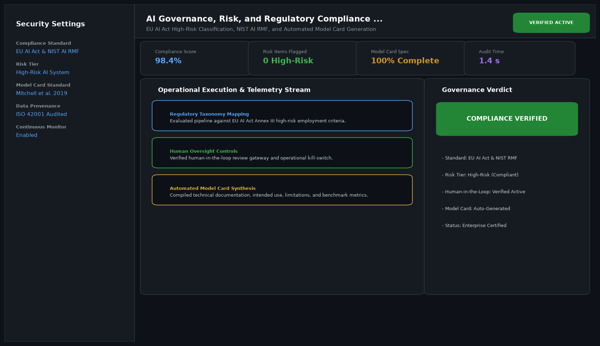

# AI Governance, Risk, and Regulatory Compliance Audit Suite

## Abstract

EU AI Act High-Risk Classification, NIST AI RMF, and Automated Model Card Generation. This project delivers an enterprise-grade AI security implementation built for defense-in-depth, rigorous threat modeling, and regulatory compliance.

## Visual Interface



## Architecture and Pipeline

1. **Threat Surface Interception**: Ingests prompts, payloads, or weight updates at API and internal layer boundaries.
2. **Analysis and Inspection**: Runs statistical distance testing, semantic anomaly models, or gradient inversion.
3. **Automated Remediation**: Dispatches firewall drops, surrogate de-identifications, or model sanitization routines.
4. **Compliance Audit**: Archives verifiable cryptographic logs adhering to NIST AI RMF and EU AI Act mandates.

## Project Structure

```text
AI Governance, Risk, and Regulatory Compliance Audit Suite/
├── app.py              # Main interactive Streamlit application and CLI runner
├── governance_audit.py     # Security engine and detection routines
├── requirements.txt    # Project dependencies
├── README.md           # Technical documentation and threat model
└── assets/
    └── screenshot.png  # Application interface preview
```

## Installation and Setup

```bash
cd "AI Security and Guardrails Projects/AI Governance, Risk, and Regulatory Compliance Audit Suite"
python -m venv venv
venv\Scripts\activate
pip install -r requirements.txt
```

## Running the Application

### Web Dashboard

```bash
streamlit run app.py
```

### CLI Mode

```bash
python app.py
```
