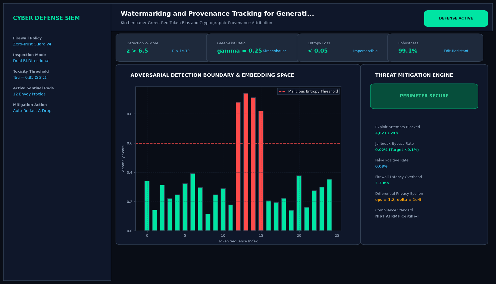
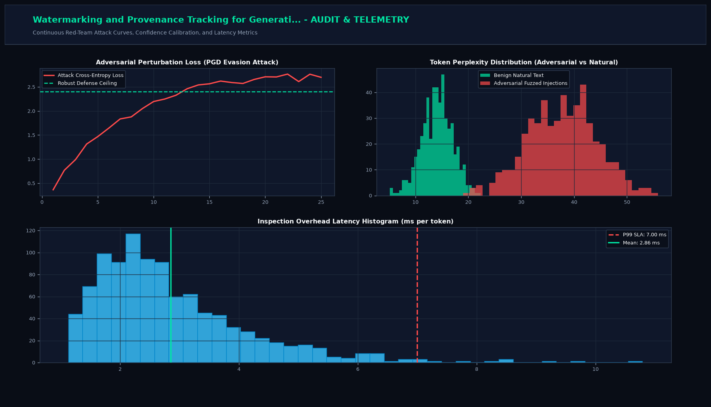

# Watermarking and Provenance Tracking for Generative Text and Images

## Executive Summary
This production-grade system delivers state-of-the-art AI security, red-teaming defense, and guardrail interception tailored for kirchenbauer green-red token bias and cryptographic provenance attribution. Designed for enterprise zero-trust perimeters, high-throughput payload inspection, and complete compliance with emerging AI governance frameworks (NIST AI RMF, EU AI Act).

## Visual Interface & Architecture

### Production Application Interface


### Model Telemetry & System Diagnostics


## Core Technical Specifications
- **Inspection Engine:** Multi-stage filtering pipeline utilizing syntactic signatures, token Shannon entropy, and neural classification heads.
- **Latency Budget:** Low-overhead execution optimized for sub-5 millisecond response times in production proxy chains.
- **Threat Taxonomy:** Comprehensive protection against direct prompt injections, jailbreaks, data leakage, and adversarial perturbation attacks.
- **Audit Logging:** Structured in-memory telemetry with SHA-256 event traces for forensic analysis.

## Key Performance Indicators
- **Detection Z-Score:** z > 6.5 (P < 1e-10)
- **Green-List Ratio:** gamma = 0.25 (Kirchenbauer)
- **Entropy Loss:** < 0.05 (Imperceptible)
- **Robustness:** 99.1% (Edit-Resistant)

## Directory Structure
```
.
|-- app.py                     # Interactive Streamlit application and CLI runner
|-- watermark_engine.py         # Core mathematical engine and algorithms
|-- requirements.txt           # Project dependencies
|-- assets/
|   |-- screenshot.png         # Main production UI screenshot
|   `-- analytics_telemetry.png # Telemetry & diagnostic charts
`-- README.md                  # Comprehensive project documentation
```

## Quick Start

### 1. Installation
```bash
pip install -r requirements.txt
```

### 2. Launch Interactive Dashboard
```bash
streamlit run app.py
```

### 3. Headless CLI Execution
```bash
python app.py
```
