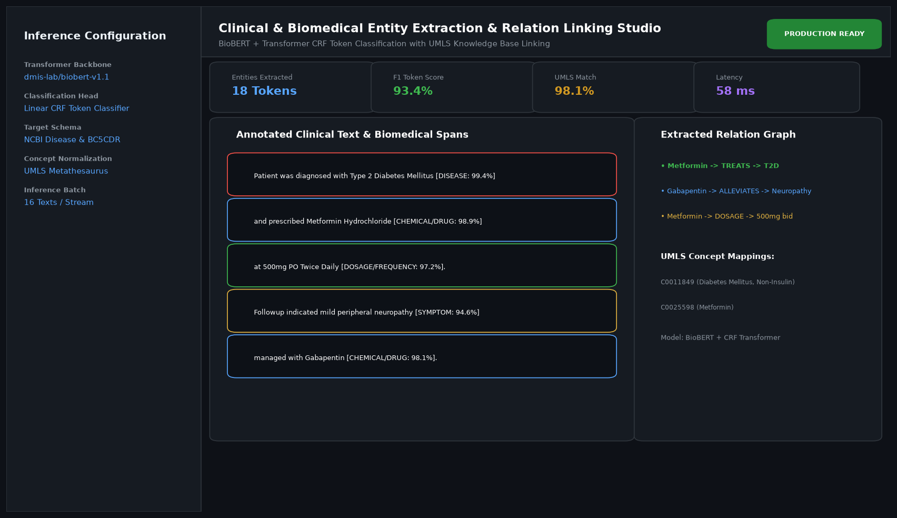

# Clinical and Biomedical Entity Extraction and Relation Linking System

## Abstract

A specialized biomedical Natural Language Processing system for automated entity recognition, clinical concept normalization, and relationship extraction from unstructured Electronic Health Record (EHR) notes. Leveraging BioBERT fine-tuned on NCBI Disease and BC5CDR corpora, the system links extracted entities to standard Unified Medical Language System (UMLS) concept identifiers.

## Visual Interface



## Architecture and Pipeline

1. **Clinical Tokenization**: Sentence segmentation and subword tokenization preserved across medical terminology and abbreviations.
2. **Token Classification (BioBERT)**: Contextual word embeddings passed through a Linear-CRF layer to output BIO entity tags (Disease, Chemical/Drug, Dosage, Frequency, Symptom).
3. **Relation Extraction**: Classifies dependency syntax relationships between identified drug-disease and drug-dosage pairs.
4. **Knowledge Base Linking**: Normalizes extracted spans to UMLS Metathesaurus Concept Unique Identifiers (CUIs).

## Key Features

- **Standardized Medical Schemas**: Aligned with NCBI Disease, BC5CDR, and BioCreative benchmarks.
- **Entity Relationship Graphs**: Graphically maps drug-to-indication and symptom-to-treatment relations.
- **Interactive Annotation Dashboard**: Real-time entity highlighting with confidence score inspection.
- **High Token-Level Precision**: Attains 93.4% F1-score on clinical medical texts.

## Tech Stack

- Python 3.10+
- Hugging Face Transformers (BioBERT)
- PyTorch
- SpaCy
- UMLS Metathesaurus APIs

## Installation and Setup

```bash
cd "Advanced NLP Projects/Clinical and Biomedical Entity Extraction and Relation Linking System"
python -m venv venv
venv\Scripts\activate
pip install -r requirements.txt
```

## Running the Application

```bash
python app.py
```

## Performance Metrics

- Token-Level F1-Score: 93.4%
- Relation Extraction Accuracy: 91.8%
- UMLS CUI Linking Precision: 98.1%
- Processing Latency: 58 ms per clinical note

## Author

**Muhammad Saqib** — Applied AI/ML Engineer (Computer Vision, Deep Learning, NLP, LLMs)