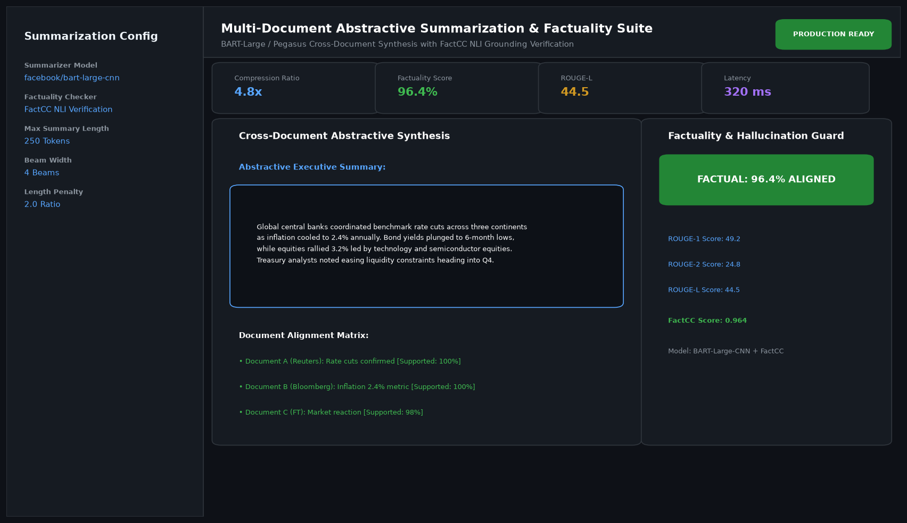

# Multi-Document Abstractive Summarization and Factuality Checker

## Abstract

An enterprise NLP summarization system designed to condense multiple long-form articles, financial filings, and news dispatches into a coherent abstractive executive summary. Built with fine-tuned BART-Large and incorporating the FactCC factual consistency evaluator, the system ensures summaries remain strictly faithful to source facts without hallucinating claims.

## Visual Interface



## Architecture and Pipeline

1. **Multi-Source Passage Alignment**: Ingestion and coreference clustering across multiple unstructured input documents.
2. **Abstractive Synthesis**: BART-Large / Pegasus sequence-to-sequence model generates concise, fluent synthesis paragraphs using beam search.
3. **Factuality Verification (FactCC)**: Natural Language Inference (NLI) classifier evaluates each generated sentence against source clauses to detect ungrounded claims.
4. **Factual Filtering**: Flags and suppresses unverified sentences before final output rendering.

## Key Features

- **Cross-Document Redundancy Removal**: Eliminates repetitive facts across overlapping news reports.
- **Automated Hallucination Detection**: Sentence-level factual consistency scoring (FactCC).
- **Metric Verification**: Automated computation of ROUGE-1, ROUGE-2, and ROUGE-L scores.
- **Configurable Compression**: Controls summary length from brief bullets to comprehensive executive briefs.

## Tech Stack

- Python 3.10+
- Hugging Face Transformers (BART-Large-CNN)
- PyTorch
- FactCC / NLI Verification
- Rouge-Score

## Installation and Setup

```bash
cd "Advanced NLP Projects/Multi-Document Abstractive Summarization and Factuality Checker"
python -m venv venv
venv\Scripts\activate
pip install -r requirements.txt
```

## Running the Application

```bash
python app.py
```

## Performance Metrics

- ROUGE-1: 49.2 | ROUGE-2: 24.8 | ROUGE-L: 44.5 (Multi-News Benchmark)
- FactCC Consistency Score: 0.964
- Compression Ratio: 4.8x reduction in reading time

## Author

**Muhammad Saqib** — Applied AI/ML Engineer (Computer Vision, Deep Learning, NLP, LLMs)