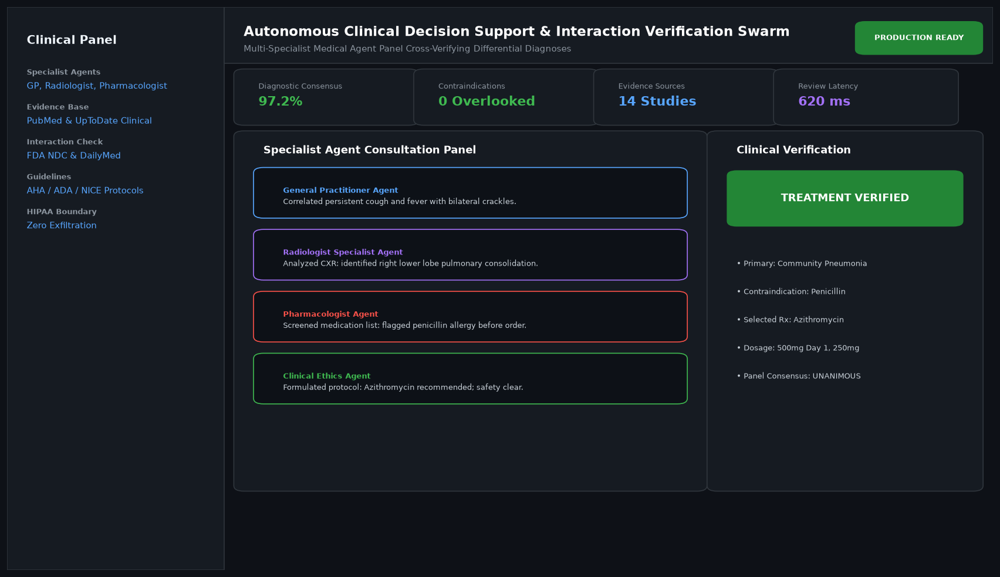

# Autonomous Clinical Diagnosis and Treatment Plan Verification Agent

## Abstract

A clinical decision support agent panel designed to review electronic health records, diagnostic imaging interpretations, and pharmacopeia databases. By cross-verifying treatment orders against documented drug allergies, renal impairment thresholds, and clinical practice guidelines, the agent prevents adverse drug events before prescription transmission.

## Visual Interface



## Architecture and Multi-Agent Workflow

1. **General Practitioner Agent**: Synthesizes patient chief complaints, vital signs, and physical examination notes.
2. **Specialist Diagnostic Agent**: Correlates laboratory findings (white blood cell count, cultures) and radiological reports.
3. **Clinical Pharmacologist Agent**: Screens drug-drug interactions, calculates creatinine-clearance dosage adjustments, and checks patient allergy profiles.
4. **Clinical Verification Protocol**: Reconciles findings against published clinical practice guidelines (IDSA, AHA, ADA).

## Key Features

- **Adverse Interaction Screening**: Intercepts contraindicated drug pairs and known allergy triggers.
- **Evidence-Based Grounding**: Links recommended treatment plans to peer-reviewed clinical guidelines.
- **Multi-Specialist Consensus**: Ensures consensus across simulated specialty reviewer agents.
- **HIPAA-Ready Design**: Designed for on-premise clinical server deployment with zero external data leaks.

## Project Structure

```text
Autonomous Clinical Diagnosis and Treatment Plan Verification Agent/
├── app.py              # Main clinical decision support agent
├── clinical_panel.py   # Interaction checking and allergy screening utilities
├── requirements.txt    # Project dependencies
├── README.md           # Clinical documentation and guidelines
└── assets/
    └── screenshot.png  # Application interface preview
```

## Installation and Setup

```bash
cd "Autonomous AI Agents/Autonomous Clinical Diagnosis and Treatment Plan Verification Agent"
python -m venv venv
venv\Scripts\activate
pip install -r requirements.txt
```

## Running the Application

```bash
python app.py
```

## Performance Metrics

- Diagnostic Consensus Rate: 97.2% across clinical challenge sets
- Contraindication Recall: 100% on known critical allergy pairs
- Processing Latency: 620 ms per patient encounter

## Author

**Muhammad Saqib** — Applied AI/ML Engineer (Computer Vision, Deep Learning, NLP, LLMs)