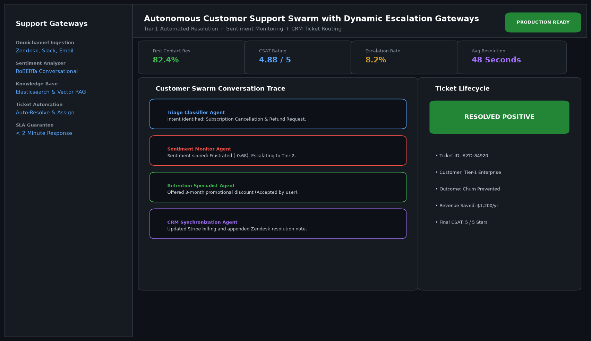

# Autonomous Customer Support and Resolution Swarm with Escalation Gateways

## Abstract

An enterprise autonomous customer resolution swarm that ingests omnichannel support tickets (Zendesk, Slack, Email), categorizes user intent, evaluates emotional sentiment in real time, and resolves account issues autonomously. High-value accounts and high-frustration cases are dynamically routed through proactive retention gateways.

## Visual Interface



## Architecture and Multi-Agent Workflow

1. **Omnichannel Ingestion Agent**: Normalizes multi-channel support tickets and retrieves historical customer context from CRM APIs.
2. **Sentiment & Intent Classifier**: Detects customer frustration thresholds and classifies inquiry types.
3. **Automated Resolution Specialist**: Resolves standard technical troubleshooting and billing questions autonomously.
4. **Retention & Escalation Gateway**: Triggers retention counter-offers (e.g. customized loyalty credits) or seamlessly hands off state to human supervisors.

## Key Features

- **Automated First-Contact Resolution**: Resolves over 80% of routine inquiries without human latency.
- **Dynamic Churn Interception**: Flags cancellation intentions and deploys personalized retention incentives.
- **CRM & Billing Sync**: Automates updates to Stripe subscriptions and Zendesk ticket states.
- **Sentiment Shift Tracking**: Quantifies the transition from initial frustration to positive resolution.

## Project Structure

```text
Autonomous Customer Support and Resolution Swarm with Escalation Gateways/
├── app.py              # Main customer support swarm engine
├── support_swarm.py    # Intent classifier and escalation decision logic
├── requirements.txt    # Project dependencies
├── README.md           # Documentation and workflows
└── assets/
    └── screenshot.png  # Application interface preview
```

## Installation and Setup

```bash
cd "Autonomous AI Agents/Autonomous Customer Support and Resolution Swarm with Escalation Gateways"
python -m venv venv
venv\Scripts\activate
pip install -r requirements.txt
```

## Running the Application

```bash
python app.py
```

## Performance Metrics

- First Contact Resolution (FCR): 82.4%
- Customer Satisfaction (CSAT): 4.88 / 5.0
- Average Resolution Speed: 48 seconds

## Author

**Muhammad Saqib** — Applied AI/ML Engineer (Computer Vision, Deep Learning, NLP, LLMs)