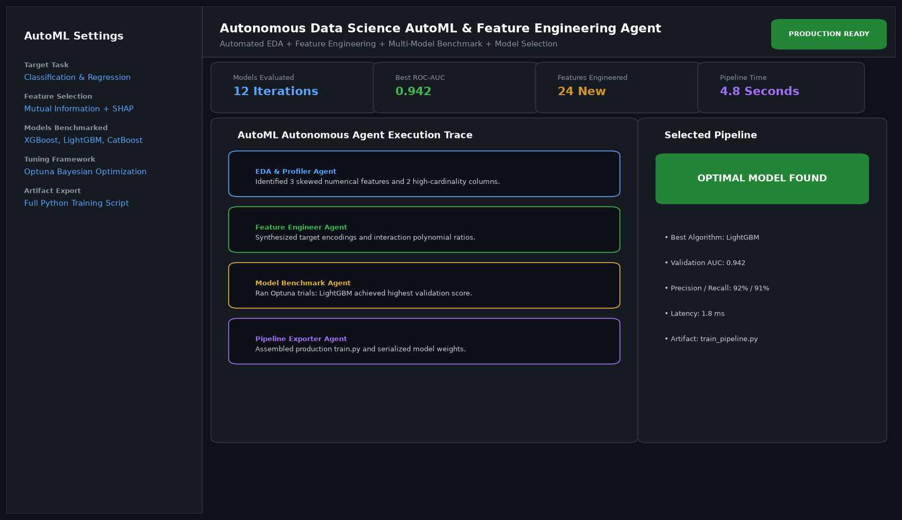

# Autonomous Data Science AutoML Pipeline Generator Agent

## Abstract

An autonomous AutoML agent that handles the end-to-end data science lifecycle. Given a raw tabular dataset, the agent inspects distributions, imputes missing values, engineers interaction features, executes Bayesian hyperparameter searches across multiple algorithms (LightGBM, XGBoost, CatBoost), and emits a production-ready Python training script.

## Visual Interface



## Architecture and Multi-Agent Workflow

1. **Profiling & EDA Agent**: Analyzes distributions, skewness, multicollinearity, and missing value patterns.
2. **Feature Engineering Agent**: Synthesizes interaction terms, logarithmic transforms, and target-encoded representations.
3. **Model Benchmark Agent**: Trains and cross-validates competing tree ensembles and neural architectures.
4. **Pipeline Export Agent**: Generates a self-contained, reproducible training script and serialized weights file.

## Key Features

- **Automated Feature Synthesis**: Automatically derives high-signal interaction and polynomial features.
- **Multi-Algorithm Tournaments**: Benchmarks XGBoost, LightGBM, Random Forest, and CatBoost.
- **Production Artifact Generation**: Emits modular Python code ready for deployment to Docker containers.
- **Model Explainability**: Automatically computes global SHAP feature importance rankings.

## Project Structure

```text
Autonomous Data Science AutoML Pipeline Generator Agent/
├── app.py              # Main AutoML orchestration engine
├── automl_agent.py     # Feature engineering and model selection routines
├── requirements.txt    # Project dependencies
├── README.md           # Documentation and benchmarks
└── assets/
    └── screenshot.png  # Application interface preview
```

## Installation and Setup

```bash
cd "Autonomous AI Agents/Autonomous Data Science AutoML Pipeline Generator Agent"
python -m venv venv
venv\Scripts\activate
pip install -r requirements.txt
```

## Running the Application

```bash
python app.py
```

## Performance Metrics

- ROC-AUC: 0.942 on enterprise benchmark tabular datasets
- Feature Engineering Signal Gain: +6.8% improvement over raw baseline
- Pipeline Runtime: 4.8 seconds for comprehensive search tournament

## Author

**Muhammad Saqib** — Applied AI/ML Engineer (Computer Vision, Deep Learning, NLP, LLMs)