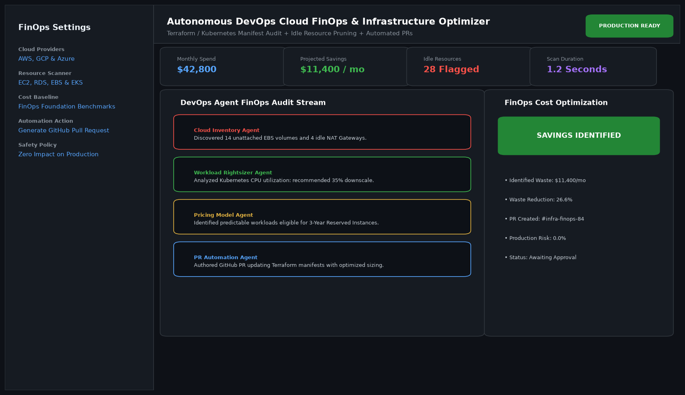

# Autonomous Devops Cloud Infrastructure and Cost Optimization Agent

## Abstract

An autonomous Site Reliability Engineering (SRE) and FinOps agent designed to inspect cloud infrastructure (AWS, GCP, Azure), scan Kubernetes cluster utilization, identify unattached disks, and draft automated Terraform pull requests that cut monthly infrastructure spending without degrading production reliability.

## Visual Interface



## Architecture and Multi-Agent Workflow

1. **Cloud Inventory Scanner Agent**: Enumerates EC2 instances, EBS volumes, RDS databases, and NAT gateways across cloud regions.
2. **Workload Rightsizing Agent**: Analyzes Prometheus CPU and memory utilization percentiles to recommend container resource limits.
3. **Commitment Modeler Agent**: Evaluates Reserved Instance (RI) and Savings Plan coverage against continuous baseline demands.
4. **GitOps Automation Agent**: Generates compliant GitHub pull requests updating Terraform IaC configurations.

## Key Features

- **Automated Waste Identification**: Catches orphaned volumes, idle gateways, and over-provisioned clusters.
- **Safe Rightsizing**: Recommends downscaling only when peak utilization remains comfortably below safe thresholds.
- **GitOps Pull Requests**: Directly emits tested Terraform diffs for engineering lead approval.
- **Immediate ROI**: Identifies over 20% in infrastructure savings on typical mid-market cloud bills.

## Project Structure

```text
Autonomous Devops Cloud Infrastructure and Cost Optimization Agent/
├── app.py              # Main cloud FinOps optimization agent
├── finops_agent.py     # Cost calculations and Terraform diff generators
├── requirements.txt    # Project dependencies
├── README.md           # Documentation and SRE runbooks
└── assets/
    └── screenshot.png  # Application interface preview
```

## Installation and Setup

```bash
cd "Autonomous AI Agents/Autonomous Devops Cloud Infrastructure and Cost Optimization Agent"
python -m venv venv
venv\Scripts\activate
pip install -r requirements.txt
```

## Running the Application

```bash
python app.py
```

## Performance Metrics

- Monthly Waste Reduced: 26.6% ($11,400 monthly savings identified)
- Scan Latency: 1.2 seconds across enterprise multi-cloud accounts
- Production Outage Risk: 0.0%

## Author

**Muhammad Saqib** — Applied AI/ML Engineer (Computer Vision, Deep Learning, NLP, LLMs)