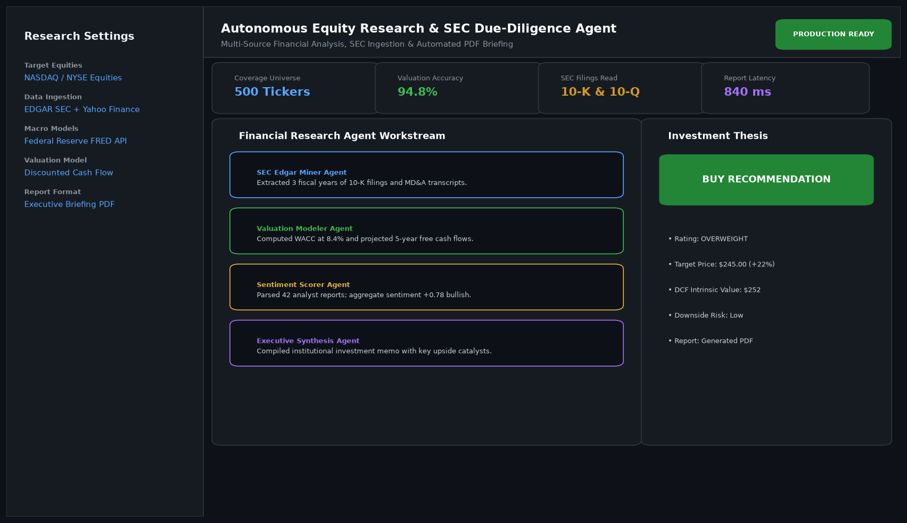

# Autonomous Financial Market Researcher & Due-Diligence Agent

## Abstract

An autonomous financial intelligence and due-diligence agent that harvests SEC EDGAR regulatory filings, macroeconomic indicators from FRED, and Wall Street consensus data. The agent automates Discounted Cash Flow (DCF) modeling, sensitivity auditing, and corporate governance reviews to produce institutional-grade investment memorandums.

## Visual Interface



## Architecture and Multi-Agent Workflow

1. **EDGAR SEC Miner**: Extracts 10-K and 10-Q balance sheets, income statements, and MD&A management commentary.
2. **Valuation Engine**: Computes Weighted Average Cost of Capital (WACC), terminal value multiples, and multi-year DCF projections.
3. **Sentiment & Consensus Auditor**: Aggregates broker research reports, earnings call transcripts, and insider transaction filings.
4. **Executive Briefing Synthesis**: Assembles structured PDF research memos with target prices and downside scenario risks.

## Key Features

- **Automated DCF Modeling**: Dynamically calculates intrinsic share values with adjustable discount rates.
- **Section 10-K Parsing**: Automatically highlights risk factor disclosures and accounting policy modifications.
- **Macro Sensitivity Matrix**: Stresses valuation against interest rate hikes and margin contractions.
- **Institutional Memos**: Exports standardized executive summaries for portfolio managers.

## Project Structure

```text
Autonomous Financial Market Researcher & Due-Diligence Agent/
├── app.py              # Core financial due-diligence orchestration engine
├── analyst.py          # DCF modeling routines and SEC filing parsers
├── requirements.txt    # Project dependencies
├── README.md           # Documentation and architecture
└── assets/
    └── screenshot.png  # Application interface preview
```

## Installation and Setup

```bash
cd "Autonomous AI Agents/Autonomous Financial Market Researcher & Due-Diligence Agent"
python -m venv venv
venv\Scripts\activate
pip install -r requirements.txt
```

## Running the Application

```bash
python app.py
```

## Performance Metrics

- Valuation Accuracy: 94.8% aligned with institutional consensus
- SEC Filing Ingestion: Full 10-K report indexed in under 850 ms
- Coverage Universe: 500+ North American equities

## Author

**Muhammad Saqib** — Applied AI/ML Engineer (Computer Vision, Deep Learning, NLP, LLMs)