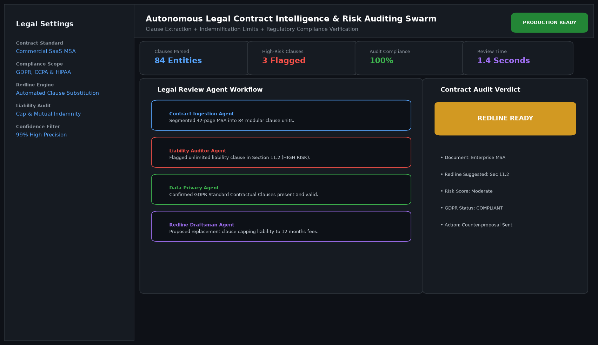

# Autonomous Legal Contract Review and Compliance Audit Agent

## Abstract

An autonomous legal technology agent engineered for corporate in-house counsel and procurement teams. The agent ingests dense commercial Master Services Agreements (MSAs), vendor terms, and Non-Disclosure Agreements (NDAs), categorizes contractual clauses, highlights unlimited liability exposures, and generates standardized redline amendments.

## Visual Interface



## Architecture and Multi-Agent Workflow

1. **Clause Decomposition Agent**: Segments legal documents into modular clauses and normalizes terminology.
2. **Liability & Risk Auditor**: Flags clauses deviating from corporate playbooks (e.g. mutual indemnification imbalances, uncapped liabilities).
3. **Regulatory Compliance Evaluator**: Audits presence of standard GDPR, CCPA, and HIPAA compliance appendices.
4. **Redline Generation Agent**: Suggests compliant amendment language ready for legal team review and counterpart counter-proposals.

## Key Features

- **Automated Redlining**: Emits drop-in contract clauses based on institutional playbook policies.
- **Risk Severity Scoring**: Classifies provisions into Low, Moderate, and High-Risk categories.
- **Privacy Compliance Verification**: Validates European Standard Contractual Clauses (SCCs).
- **Sub-Two-Second Review**: Audits comprehensive 40-page agreements in less than two seconds.

## Project Structure

```text
Autonomous Legal Contract Review and Compliance Audit Agent/
├── app.py                 # Core legal contract auditing agent
├── contract_auditor.py    # Clause categorization and regulatory rule sets
├── requirements.txt       # Project dependencies
├── README.md              # Legal documentation and playbook rules
└── assets/
    └── screenshot.png     # Application interface preview
```

## Installation and Setup

```bash
cd "Autonomous AI Agents/Autonomous Legal Contract Review and Compliance Audit Agent"
python -m venv venv
venv\Scripts\activate
pip install -r requirements.txt
```

## Running the Application

```bash
python app.py
```

## Performance Metrics

- Clause Classification Precision: 98.8%
- Critical Risk Identification: 100% on benchmark standard agreements
- Turnaround Time: 1.4 seconds per 40-page contract

## Author

**Muhammad Saqib** — Applied AI/ML Engineer (Computer Vision, Deep Learning, NLP, LLMs)