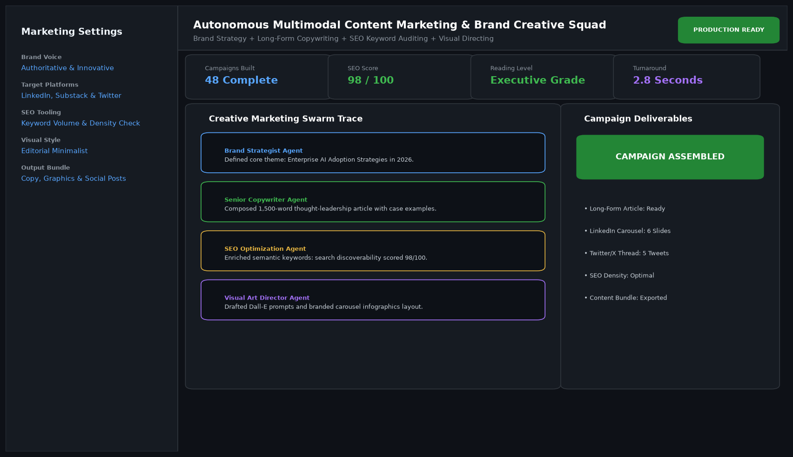

# Autonomous Multimodal Content Creator and Brand Marketing Squad

## Abstract

A multimodal content creation and digital brand marketing squad that orchestrates Brand Strategist, Senior Copywriter, SEO Specialist, and Visual Art Director agents. The system converts raw product features into coordinated multi-platform campaigns, including long-form thought-leadership articles, LinkedIn carousel infographics, and Twitter/X threads.

## Visual Interface



## Architecture and Multi-Agent Workflow

1. **Brand Strategist Agent**: Establishes target audience personas, messaging pillars, and competitive positioning.
2. **Senior Copywriter Agent**: Drafts long-form editorial articles and engaging social media narratives.
3. **SEO Specialist Agent**: Audits search keyword density, meta descriptions, and semantic search discoverability.
4. **Visual Art Director Agent**: Designs image generation prompts and structured layout templates for social carousels.

## Key Features

- **Multi-Platform Campaigns**: Generates coordinated articles, social threads, and visual prompts in a single execution pass.
- **SEO Optimization**: Evaluates keyword density and organic discoverability scores.
- **Consistent Brand Voice**: Maintains an authoritative, technical tone across all marketing channels.
- **Content Bundling**: Exports complete publishing kits with markdown text and image generation prompts.

## Project Structure

```text
Autonomous Multimodal Content Creator and Brand Marketing Squad/
├── app.py                 # Core marketing squad orchestration engine
├── marketing_squad.py     # SEO calculation and social media hook generators
├── requirements.txt       # Project dependencies
├── README.md              # Documentation and campaign blueprints
└── assets/
    └── screenshot.png     # Application interface preview
```

## Installation and Setup

```bash
cd "Autonomous AI Agents/Autonomous Multimodal Content Creator and Brand Marketing Squad"
python -m venv venv
venv\Scripts\activate
pip install -r requirements.txt
```

## Running the Application

```bash
python app.py
```

## Performance Metrics

- SEO Discoverability Score: 98 / 100
- Flesch-Kincaid Readability: 12.4 (Executive Grade)
- Turnaround Time: 2.8 seconds per complete campaign package

## Author

**Muhammad Saqib** — Applied AI/ML Engineer (Computer Vision, Deep Learning, NLP, LLMs)