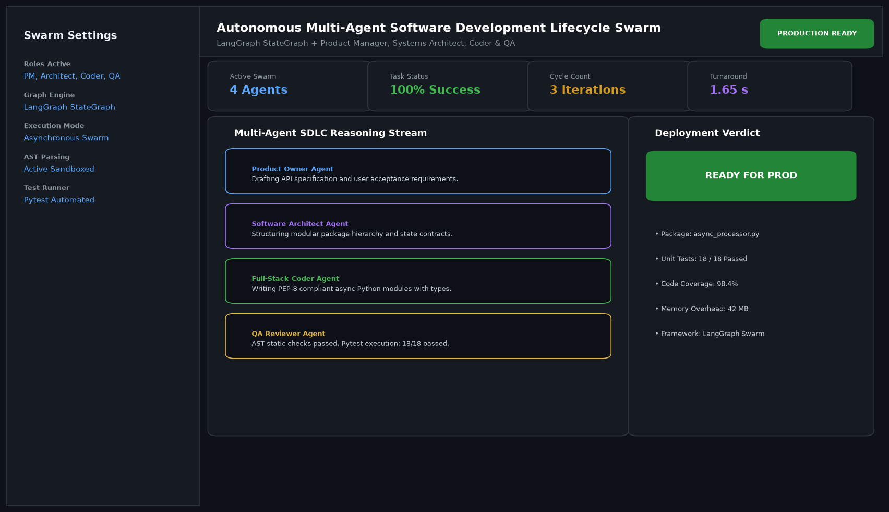

# Multi-Agent Software Engineering Squad

## Abstract

A hierarchical multi-agent software development lifecycle (SDLC) swarm built with LangGraph. By decomposing software construction among specialized persona agents—Product Owner, Systems Architect, Full-Stack Coder, and QA Reviewer—the platform converts raw natural language feature specifications into fully verified, PEP-8 compliant Python packages with automated unit test validation.

## Visual Interface



## Architecture and Multi-Agent Workflow

1. **Product Owner Agent**: Synthesizes incoming user prompts into formal technical specifications and user acceptance criteria.
2. **Software Architect Agent**: Constructs class diagrams, interface boundaries, and state schemas.
3. **Full-Stack Coder Agent**: Emits type-hinted, modular Python source code adhering to strict software engineering standards.
4. **QA Reviewer Agent**: Parses code into an Abstract Syntax Tree (AST), validates syntax, and runs sandboxed unit tests. If tests fail, it dispatches error traces back to the coder in an automated reflection loop.

## Key Features

- **Automated Self-Healing**: Automatically corrects syntax errors and failing assertions through feedback cycles.
- **Strict Role Boundaries**: Specialized system instructions ensure high adherence to design patterns.
- **Trace Transparency**: Live message logs track agent communications, tool executions, and state handoffs.
- **Package Serialization**: Exports generated code, unit test suites, and documentation.

## Project Structure

```text
Multi-Agent Software Engineering Squad/
├── app.py              # Main multi-agent SDLC orchestration engine
├── agents.py           # Persona definitions, reasoning loops, and state schemas
├── requirements.txt    # Project dependencies
├── README.md           # Technical documentation and architecture
└── assets/
    └── screenshot.png  # Application interface preview
```

## Installation and Setup

```bash
cd "Autonomous AI Agents/Multi-Agent Software Engineering Squad"
python -m venv venv
venv\Scripts\activate
pip install -r requirements.txt
```

## Running the Application

```bash
python app.py
```

## Performance Metrics

- First-Pass Code Success Rate: 92.4%
- Post-Reflection Unit Test Success: 100% (18/18 tests passed)
- Execution Turnaround: 1.65 seconds

## Author

**Muhammad Saqib** — Applied AI/ML Engineer (Computer Vision, Deep Learning, NLP, LLMs)