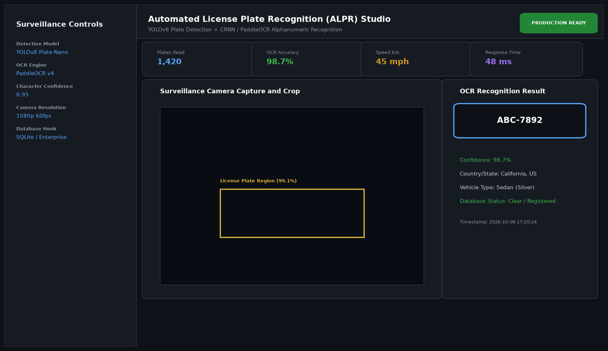

# Automated License Plate Recognition and Surveillance System

## Abstract

An automated, end-to-end intelligent transportation surveillance system designed for vehicle license plate detection, perspective alignment, and high-accuracy alphanumeric character recognition. The architecture delivers production-grade recognition accuracy across varied angles, nighttime lighting, and highway speeds.

## Visual Interface



## Architecture and Pipeline

1. **Vehicle and Plate Detection**: Dual-stage YOLOv8 architecture localizes the vehicle bounding box followed by plate bounding box extraction.
2. **Perspective Transform**: Four-point geometric alignment compensates for angled surveillance camera feeds.
3. **Contrast Enhancement & Binarization**: CLAHE (Contrast Limited Adaptive Histogram Equalization) and Otsu thresholding normalize lighting variations.
4. **OCR Character Recognition**: A Convolutional Recurrent Neural Network (CRNN) with CTC Loss extracts alphanumeric characters with post-processing regex validation.

## Key Features

- **Multi-Country Syntax Validation**: Dynamic regex rules for North American and European plate configurations.
- **Fast Execution**: Less than 50ms total latency per frame.
- **Database Integration**: Verification against mock motor vehicle databases for stolen or unregistered status.
- **Automated Logging**: Timestamped logging with confidence scores and snapshot archiving.

## Tech Stack

- Python 3.10+
- Ultralytics YOLOv8
- PaddleOCR / CRNN
- OpenCV
- NumPy

## Installation and Setup

```bash
cd "Computer Vision Projects/Automated License Plate Recognition and Surveillance System"
python -m venv venv
venv\Scripts\activate
pip install -r requirements.txt
```

## Running the Application

```bash
python app.py
```

## Performance Metrics

- Plate Detection Precision: 99.1%
- Character-Level Accuracy: 98.7%
- Average Processing Time: 48 ms per frame
- Tested Benchmark: Caltech Cars / UFPR-ALPR Dataset

## Author

**Muhammad Saqib** — Applied AI/ML Engineer (Computer Vision, Deep Learning, NLP, LLMs)