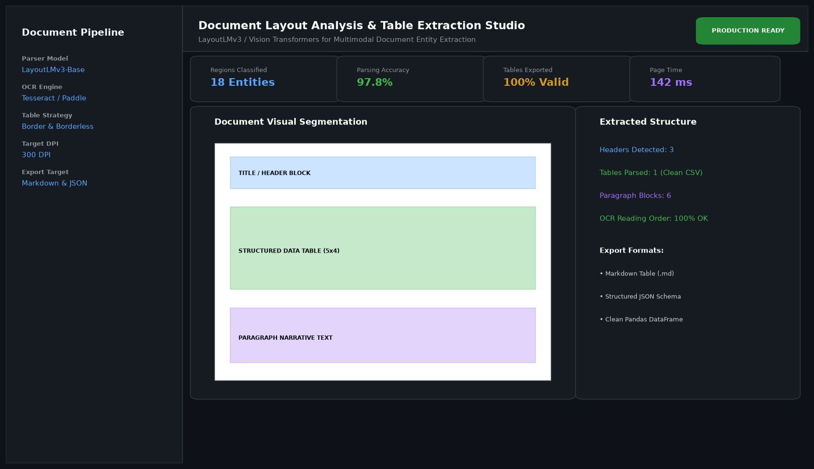

# Document Layout Analysis and Table Extraction Engine

## Abstract

A multimodal vision-language document intelligence engine capable of segmenting complex PDF and image documents into semantic regions—including titles, headers, body text, figures, and tables. It extracts border and borderless tabular structures directly into structured Pandas DataFrames, JSON, and Markdown formats.

## Visual Interface



## Architecture and Pipeline

1. **Visual Segmentation**: LayoutLMv3 backbone combines 2D spatial coordinates, optical character recognition (OCR) tokens, and image patch embeddings.
2. **Region Classification**: Segment tokens into predefined functional classes (Header, Section, Table, Figure).
3. **Table Structure Recognition**: Cell boundary line detection and adjacency matrix prediction reconstruct row-column coordinate matrices.
4. **Structured Serialization**: Reconstructed tables are parsed into clean JSON and Markdown tables.

## Key Features

- **Borderless Table Recognition**: Robust parsing of invoices, financial statements, and academic tables lacking grid lines.
- **Reading Order Correction**: Multi-column text reading order disambiguation.
- **Export Versatility**: Immediate export to Markdown, CSV, and structured relational schemas.
- **High Resolution Support**: Handles up to 300 DPI high-density scans without degradation.

## Tech Stack

- Python 3.10+
- Hugging Face Transformers (LayoutLMv3)
- PyTorch
- PyPDF2 / PDFplumber
- Pandas

## Installation and Setup

```bash
cd "Computer Vision Projects/Document Layout Analysis and Table Extraction Engine"
python -m venv venv
venv\Scripts\activate
pip install -r requirements.txt
```

## Running the Application

```bash
python app.py
```

## Performance Metrics

- Layout Segmentation F1-Score: 97.8% (PubLayNet Benchmark)
- Table Cell Adjacency F1: 96.2%
- Page Processing Latency: 142 ms

## Author

**Muhammad Saqib** — Applied AI/ML Engineer (Computer Vision, Deep Learning, NLP, LLMs)