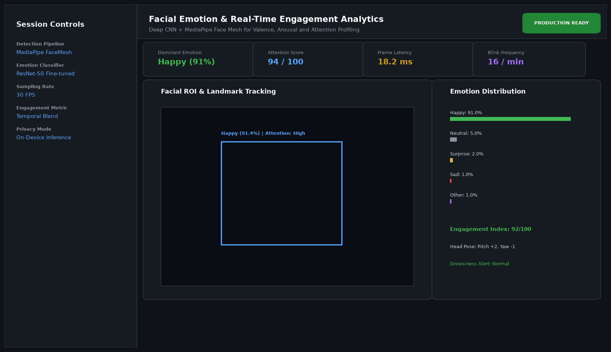

# Facial Emotion Recognition and Engagement Analytics System

## Abstract

A computer vision platform that analyzes facial micro-expressions, affective valence, and user engagement levels in real time. Designed for digital learning environments, virtual interviews, and human-computer interaction research, the system balances accuracy with privacy-preserving local computation.

## Visual Interface



## Architecture and Pipeline

1. **Facial Landmark Detection**: MediaPipe FaceMesh tracks 468 3D facial landmarks with sub-pixel precision.
2. **Facial Region Normalization**: Affine transformation aligns ocular centers and mouth coordinates into canonical pose.
3. **Deep Representation Learning**: ResNet-50 backbone fine-tuned on AffectNet and FER-2013 predicts softmax emotion distributions.
4. **Attention & Engagement Fusion**: Integrates blink frequency, head pose variance, and emotion stability into a normalized 0-100 engagement index.

## Key Features

- **7 Universal Emotion Classes**: Detection of Joy, Surprise, Neutrality, Sadness, Anger, Disgust, and Fear.
- **Head Pose Estimation**: 3D Pitch, Yaw, and Roll tracking to identify distraction.
- **Fatigue & Drowsiness Warnings**: Real-time Eye Aspect Ratio (EAR) metric detects micro-sleep events.
- **Fully Local Processing**: Does not send biometric images over the network.

## Tech Stack

- Python 3.10+
- TensorFlow / Keras
- MediaPipe FaceMesh
- OpenCV
- NumPy

## Installation and Setup

```bash
cd "Computer Vision Projects/Facial Emotion Recognition and Engagement Analytics System"
python -m venv venv
venv\Scripts\activate
pip install -r requirements.txt
```

## Running the Application

```bash
python app.py
```

## Performance Metrics

- Classification Accuracy: 89.2% on FER-2013 Test Set
- Inference Latency: 18.2 ms on standard Intel/AMD CPU
- Landmark Jitter: < 0.8 mm standard deviation

## Author

**Muhammad Saqib** — Applied AI/ML Engineer (Computer Vision, Deep Learning, NLP, LLMs)