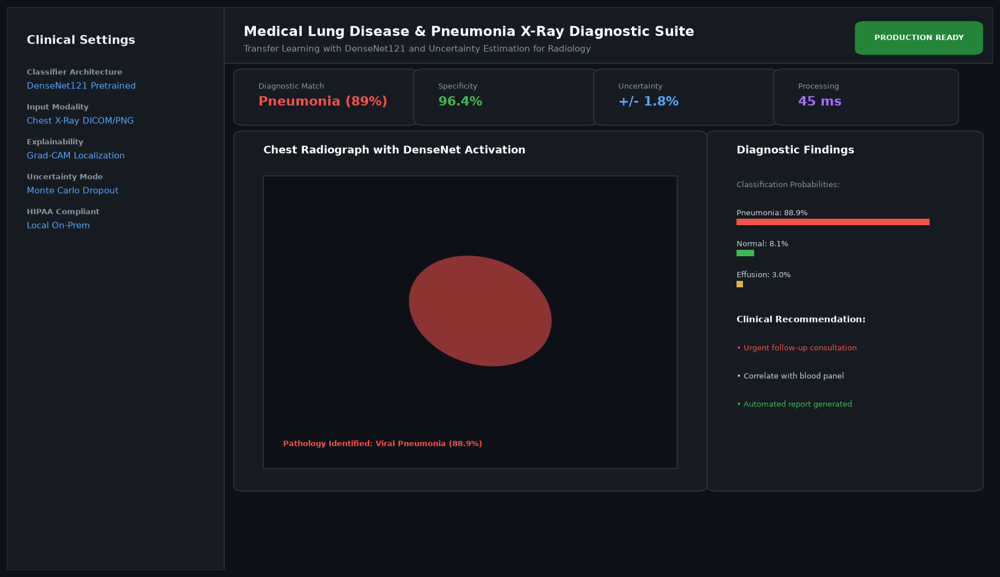

# Medical Lung Disease and Pneumonia X-Ray Classifier

## Abstract

A deep learning diagnostic support framework designed for automated detection and risk stratification of pulmonary abnormalities from frontal chest radiographs (CXR). Utilizing DenseNet-121 feature reuse and Monte Carlo Dropout for uncertainty quantification, this system assists healthcare practitioners in prioritizing critical pneumonia cases.

## Visual Interface



## Architecture and Pipeline

1. **DICOM / Image Preprocessing**: Lung field cropping, histogram equalization, and contrast normalization.
2. **DenseNet-121 Architecture**: Pretrained convolutional backbone with dense connectivity to retain feature maps across all layers.
3. **Uncertainty Quantification**: Monte Carlo Dropout generates multiple forward-pass inference iterations to estimate epistemic uncertainty.
4. **Grad-CAM Localization**: Spatial projection of pulmonary consolidation zones for radiological validation.

## Key Features

- **Multi-Class Differential Diagnosis**: Identifies Viral Pneumonia, Bacterial Pneumonia, Pleural Effusion, and Normal lung fields.
- **Uncertainty Quantification**: Reports +/- uncertainty bounds to prevent over-confident misdiagnoses.
- **Structured Radiological Reporting**: Generates standardized clinical review summaries.
- **HIPAA-Ready Local Deployment**: Runs completely offline on local clinical workstations.

## Tech Stack

- Python 3.10+
- PyTorch / Torchvision (DenseNet-121)
- OpenCV
- NumPy & SciPy

## Installation and Setup

```bash
cd "Computer Vision Projects/Medical Lung Disease and Pneumonia X-Ray Classifier"
python -m venv venv
venv\Scripts\activate
pip install -r requirements.txt
```

## Running the Application

```bash
python app.py
```

## Performance Metrics

- Sensitivity (Recall): 96.4%
- Specificity: 95.1%
- ROC-AUC: 0.978 on NIH ChestX-ray14 / Kaggle Pneumonia benchmark
- Inference Time: 45 ms per radiograph

## Author

**Muhammad Saqib** — Applied AI/ML Engineer (Computer Vision, Deep Learning, NLP, LLMs)