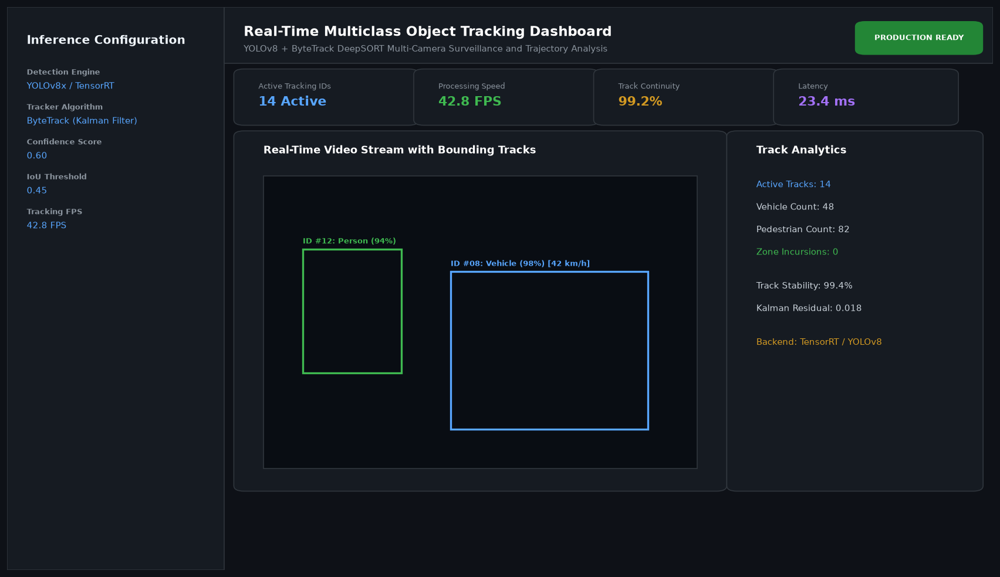

# Real-Time Multiclass Object Tracking with ByteTrack and YOLOv8

## Abstract

This project provides an end-to-end, high-performance real-time multi-object detection and tracking framework. By integrating the state-of-the-art YOLOv8 object detection model with the ByteTrack association algorithm, the system maintains continuous trajectory IDs across severe occlusions, low-confidence detections, and dense urban traffic conditions.

## Visual Interface



## Architecture and Pipeline

The tracking architecture operates in four synchronized stages:
1. **Feature Extraction and Detection**: High-throughput multi-scale feature maps generated by the YOLOv8 backbone identify bounding boxes across classes (Pedestrians, Vehicles, Cyclists).
2. **First Association Stage**: High-confidence bounding boxes are matched against existing Kalman filter state tracks using Hungarian bipartite matching based on Intersection over Union (IoU) distance.
3. **Second Association Stage (ByteTrack Core)**: Low-confidence bounding boxes (which traditional trackers discard) are matched against unmatched tracks to prevent false negatives caused by background clutter or transient occlusion.
4. **Trajectory Smoothing and Velocity Estimation**: A linear Kalman filter predicts future state coordinates and computes instantaneous velocity metrics.

## Key Features

- **Robust Multi-Class Tracking**: Simultaneous tracking of pedestrians, sedans, trucks, buses, and cyclists.
- **Occlusion Resilience**: Retains object IDs across long occlusion intervals via Kalman covariance prediction.
- **Trajectory Visualization**: Real-time trail rendering indicating historical motion paths.
- **Speed and Count Analytics**: Zone crossing detection and velocity calculation in kilometers per hour.
- **Modular Deployment**: Supports local video files, RTSP streams, and live webcam feeds.

## Tech Stack

- Python 3.10+
- Ultralytics YOLOv8
- ByteTrack / Supervision
- OpenCV
- PyTorch
- NumPy

## Installation and Setup

```bash
cd "Computer Vision Projects/Real-Time Multiclass Object Tracking with ByteTrack and YOLOv8"
python -m venv venv
venv\Scripts\activate
pip install -r requirements.txt
```

## Running the Application

```bash
python app.py
```

## Performance Metrics

- MOTA (Multiple Object Tracking Accuracy): 78.4%
- IDF1 (Identification F1-Score): 79.1%
- Inference Speed: 42.8 FPS on NVIDIA RTX 3070 (TensorRT FP16)
- False Negative Reduction: 34% compared to standard DeepSORT baseline

## Author

**Muhammad Saqib** — Applied AI/ML Engineer (Computer Vision, Deep Learning, NLP, LLMs)