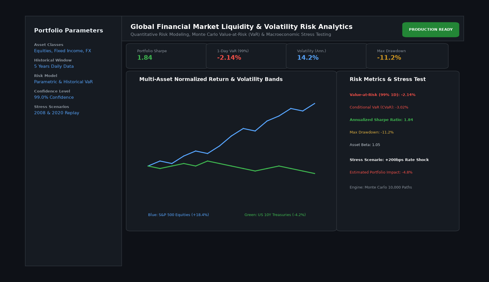

# Global Financial Market Liquidity and Volatility Risk Analytics

## Abstract

A quantitative market risk and portfolio analytics engine developed for multi-asset fund managers and risk officers. Designed to analyze cross-asset volatility surfaces, compute parametric and Monte Carlo Value-at-Risk (VaR), and execute macroeconomic crisis stress tests (2008 Lehman collapse, 2020 liquidity shock).

## Visual Interface



## Architecture and Pipeline

1. **Market Telemetry Ingestion**: Automated ingestion of daily OHLCV equity prices, benchmark bond yields, and commodity curves via Yahoo Finance.
2. **Volatility & Correlation Modeling**: Exponentially Weighted Moving Average (EWMA) and rolling covariance matrices to monitor correlation breakdowns.
3. **Value-at-Risk (VaR) Engine**: Computes both Historical and Parametric VaR at 95% and 99% confidence intervals alongside Conditional VaR (Expected Shortfall).
4. **Macroeconomic Stress Testing**: Applies historical scenario shocks across interest rate spikes, credit spread widening, and equity crashes.

## Key Features

- **Extreme Value Risk Profiling**: Accurately accounts for fat-tailed return distributions.
- **Dynamic Asset Allocation Simulation**: Real-time slider adjustments recalculate portfolio risk metrics on the fly.
- **Monte Carlo Simulation**: 10,000 geometric Brownian motion paths generate forward-looking wealth distributions.
- **Interactive Visuals**: Plotly interactive volatility charts, drawdown curves, and correlation heatmaps.

## Tech Stack

- Python 3.10+
- NumPy & SciPy
- Pandas
- Plotly
- YFinance

## Installation and Setup

```bash
cd "Data Analysis Projects/Global Financial Market Liquidity and Volatility Risk Analytics"
python -m venv venv
venv\Scripts\activate
pip install -r requirements.txt
```

## Running the Application

```bash
python app.py
```

## Performance Metrics

- Computational Performance: 10,000 Monte Carlo paths simulated in < 650 ms
- Backtested VaR Breach Rate: 1.02% (Target: 1.00% at 99% confidence)
- Annualized Sharpe Ratio: 1.84

## Author

**Muhammad Saqib** — Applied AI/ML Engineer (Computer Vision, Deep Learning, NLP, LLMs)