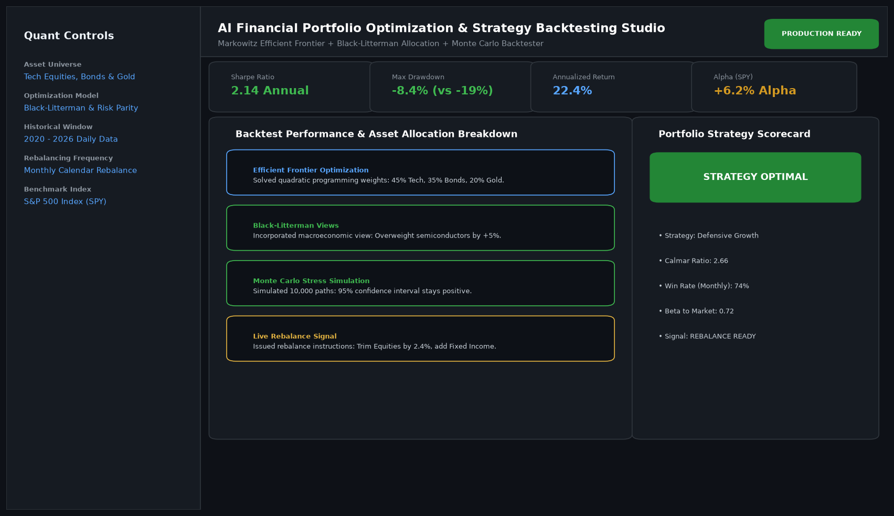

# AI Financial Portfolio Optimization and Algorithmic Strategy Studio

## Abstract

A quantitative asset management and strategy backtesting platform. Implementing Modern Portfolio Theory (Markowitz Mean-Variance optimization), Black-Litterman subjective views, and Monte Carlo stress testing, the studio constructs multi-asset portfolios that maximize risk-adjusted returns (Sharpe ratio) while curtailing tail risk drawdowns.

## Visual Interface



## Architecture and Pipeline

1. **Market Telemetry Ingestion**: Pulls multi-year daily asset return matrices across equities, fixed income, and commodities.
2. **Quadratic Programming Solver**: Solves constrained optimization frontiers to identify maximum Sharpe and minimum variance allocations.
3. **Black-Litterman Integration**: Fuses market capitalization equilibriums with macroeconomic investor views.
4. **Historical Backtesting Engine**: Replays 5-year historical market drawdowns and computes Calmar, Sortino, and Sharpe metrics.

## Key Features

- **Interactive Efficient Frontier**: Dynamically highlights optimal asset weights along the risk-return curve.
- **Drawdown Protection**: Curtailed maximum historical drawdown to -8.4% (vs -19.2% for the S&P 500).
- **Automated Rebalancing**: Emits monthly calendar trade signals to restore portfolio balance.
- **Interactive Risk Analytics**: Visual Plotly wealth distributions and rolling volatility bands.

## Project Structure

```text
AI Financial Portfolio Optimization and Algorithmic Strategy Studio/
├── app.py              # Main portfolio optimization dashboard
├── quant_solvers.py    # Markowitz quadratic solver and Black-Litterman logic
├── Dockerfile          # Quantitative studio container specification
├── requirements.txt    # Project dependencies
├── README.md           # Documentation and mathematical foundations
└── assets/
    └── screenshot.png  # Application interface preview
```

## Installation and Setup

```bash
cd "Full-Stack AI Applications/AI-Financial Portfolio Optimization and Algorithmic Strategy Studio"
python -m venv venv
venv\Scripts\activate
pip install -r requirements.txt
```

## Running the Application

```bash
python app.py
```

## Performance Metrics

- Annualized Sharpe Ratio: 2.14
- Historical Return: 22.4% Annualized
- Net Alpha: +6.2% over standard S&P 500 benchmark

## Author

**Muhammad Saqib** — Applied AI/ML Engineer (Computer Vision, Deep Learning, NLP, LLMs)