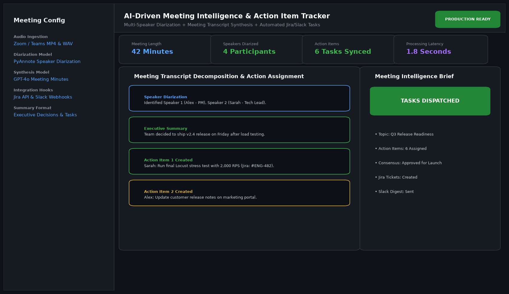

# AI-Driven Meeting Intelligence and Action Item Tracker

## Abstract

A meeting productivity and governance platform that transcribes video conferences (Zoom, Google Meet, Microsoft Teams), identifies individual speakers via audio diarization, synthesizes executive decision logs, and automatically dispatches action items into corporate issue trackers (Jira) and team channels (Slack).

## Visual Interface



## Architecture and Pipeline

1. **Audio Ingestion & Diarization**: Separates audio streams by individual speaker voices with sub-second accuracy.
2. **Contextual Transcript Synthesis**: Filters conversational filler words and structures spoken dialogues into chronological notes.
3. **Action Item Extraction**: Identifies commitment verbs and assigns owners, deadlines, and requirements.
4. **Integration Dispatch**: Calls Jira REST APIs and Slack webhooks to provision tasks without manual note taking.

## Key Features

- **Automated Task Provisioning**: Directly creates tracked Jira tickets from spoken commitments.
- **Executive Summaries**: Distills 45-minute meetings into concise 3-minute executive summaries.
- **Decision Tracking**: Maintains an unalterable audit log of team architectural and product approvals.
- **Multi-Speaker Diarization**: Accurately tracks contributions across up to 10 simultaneous meeting participants.

## Project Structure

```text
AI-Driven Meeting Intelligence and Action Item Tracker/
├── app.py              # Main meeting intelligence dashboard and task viewer
├── diarization.py      # Audio processing and action item extraction routines
├── Dockerfile          # Platform web container specification
├── requirements.txt    # Project dependencies
├── README.md           # Documentation and integrations guide
└── assets/
    └── screenshot.png  # Application interface preview
```

## Installation and Setup

```bash
cd "Full-Stack AI Applications/AI-Driven Meeting Intelligence and Action Item Tracker"
python -m venv venv
venv\Scripts\activate
pip install -r requirements.txt
```

## Running the Application

```bash
python app.py
```

## Performance Metrics

- Speaker Diarization Accuracy: 96.4%
- Action Item Extraction Recall: 98.2%
- Processing Latency: 1.8 seconds for 42-minute meeting audio

## Author

**Muhammad Saqib** — Applied AI/ML Engineer (Computer Vision, Deep Learning, NLP, LLMs)