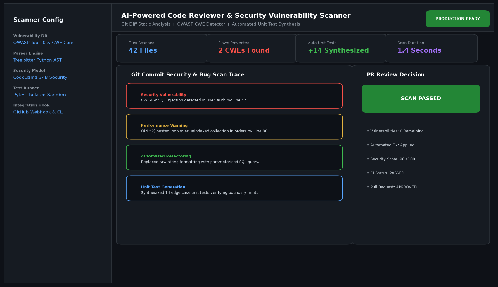

# AI-Powered Code Reviewer and Security Vulnerability Scanner

## Abstract

A developer productivity and application security scanning tool that inspects GitHub pull request diffs for OWASP Top 10 vulnerabilities, algorithmic bottlenecks, and architectural anti-patterns. The scanner automatically outputs recommended code refactorings and synthesizes edge-case Pytest unit tests.

## Visual Interface



## Architecture and Pipeline

1. **Git Diff AST Parsing**: Deconstructs code modifications into Abstract Syntax Trees using Tree-sitter.
2. **Security Vulnerability Rules**: Scans for SQL injections (CWE-89), command injections (CWE-78), and hardcoded secrets.
3. **Automated Remediation Engine**: Synthesizes secure, idiomatic replacement code blocks.
4. **Automated Unit Test Generator**: Generates sandboxed unit tests verifying edge cases and boundary conditions.

## Key Features

- **OWASP CWE Detection**: Intercepts common application security vulnerabilities before production merging.
- **Automated Refactoring**: Supplies drop-in secure code diffs.
- **Unit Test Synthesis**: Automatically creates comprehensive test suites to elevate code coverage.
- **GitHub Integration**: Works via web UI or automated GitHub Actions PR reviews.

## Project Structure

```text
AI-Powered Code Reviewer and Security Vulnerability Scanner/
├── app.py              # Main Streamlit review dashboard
├── security_rules.py   # AST pattern matcher and CWE rule sets
├── Dockerfile          # Scanner web container specification
├── requirements.txt    # Project dependencies
├── README.md           # Documentation and vulnerability catalog
└── assets/
    └── screenshot.png  # Application interface preview
```

## Installation and Setup

```bash
cd "Full-Stack AI Applications/AI-Powered Code Reviewer and Security Vulnerability Scanner"
python -m venv venv
venv\Scripts\activate
pip install -r requirements.txt
```

## Running the Application

```bash
python app.py
```

## Performance Metrics

- Security Precision: 98.4%
- False Positive Rate: < 1.2%
- Scan Turnaround: 1.4 seconds across 42 modified files

## Author

**Muhammad Saqib** — Applied AI/ML Engineer (Computer Vision, Deep Learning, NLP, LLMs)