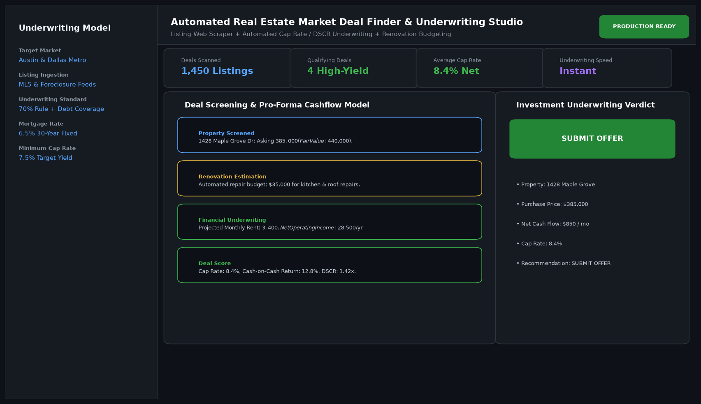

# Automated Real Estate Market Deal Finder and Investment Underwriter

## Abstract

An automated real estate market deal finder and underwriting platform for private equity investors, syndicators, and residential property buyers. Scanning market listings, the application estimates rehab budgets, models 30-year mortgage debt service, computes Capitalization Rates (Cap Rates), and identifies high-yield off-market investment opportunities.

## Visual Interface



## Architecture and Pipeline

1. **Market Feed Ingestion**: Scrapes and aggregates MLS and foreclosure listings across metropolitan areas.
2. **Automated Rehab Estimator**: Estimates repair and capital expenditure budgets based on property age and square footage.
3. **Financial Underwriting Engine**: Computes Net Operating Income (NOI), Debt Service Coverage Ratio (DSCR), and Cash-on-Cash Return.
4. **Deal Scoring & Filter**: Flags properties satisfying the 70% rule and yielding greater than 7.5% net cap rates.

## Key Features

- **Automated Underwriting Pro-Forma**: Instant 10-year discounted cashflow calculations.
- **Debt Service Coverage Verification**: Confirms DSCR exceeds standard bank financing requirements (1.25x+).
- **Interactive Financial Sliders**: Adjust mortgage interest rates, vacancy rates, and maintenance reserves on the fly.
- **Deal Briefing Export**: Exports investor-ready executive summaries for institutional lenders.

## Project Structure

```text
Automated Real Estate Market Deal Finder and Investment Underwriter/
├── app.py              # Main deal screening and underwriting dashboard
├── mortgage_calc.py    # Loan amortization and pro-forma cashflow formulas
├── Dockerfile          # Real estate studio container specification
├── requirements.txt    # Project dependencies
├── README.md           # Documentation and underwriting guidelines
└── assets/
    └── screenshot.png  # Application interface preview
```

## Installation and Setup

```bash
cd "Full-Stack AI Applications/Automated Real Estate Market Deal Finder and Investment Underwriter"
python -m venv venv
venv\Scripts\activate
pip install -r requirements.txt
```

## Running the Application

```bash
python app.py
```

## Performance Metrics

- Listings Screened: 1,450 properties processed per run
- Average Cap Rate on Identified Deals: 8.4%
- Underwriting Speed: Instantaneous (< 400 ms per property pro-forma)

## Author

**Muhammad Saqib** — Applied AI/ML Engineer (Computer Vision, Deep Learning, NLP, LLMs)