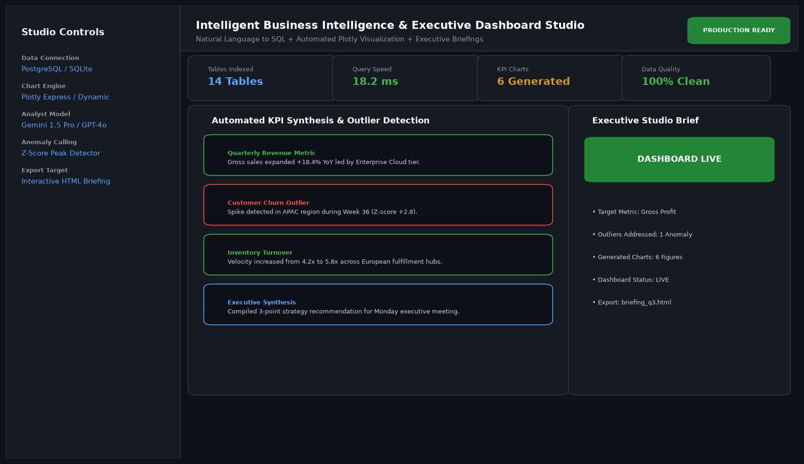

# Intelligent Business Intelligence & Executive Dashboard Studio

## Abstract

A full-stack business intelligence platform that connects directly to PostgreSQL, MySQL, and SQLite databases to transform natural language queries into interactive Plotly visualizations and automated executive briefings. Incorporating statistical anomaly detection (Z-scores), the studio flags unusual variance spikes before monthly closes.

## Visual Interface



## Architecture and Pipeline

1. **Schema Introspection**: Automatically registers table structures, keys, and column distributions.
2. **Text-to-SQL Compiler**: Translates executive inquiries into dialect-compliant read-only SQL queries.
3. **Dynamic Visualizer**: Selects appropriate visualization archetypes (waterfall, cohort heatmaps, stacked area charts).
4. **Statistical Anomaly Highlighter**: Runs Z-score rolling tests to highlight unexpected spikes and margin contractions.

## Key Features

- **Automated KPI Visuals**: Generates responsive, publication-quality Plotly interactive figures.
- **Natural Language Querying**: Eliminates reliance on custom SQL writing for business leaders.
- **Statistical Anomaly Alerts**: Flags data outliers with statistical explanations.
- **HTML Briefing Export**: Exports standalone executive briefs ready for weekly leadership reviews.

## Project Structure

```text
Intelligent Business Intelligence & Executive Dashboard Studio/
├── app.py              # Main dashboard application and executive UI
├── chart_engine.py     # Dynamic Plotly figure builders and outlier algorithms
├── Dockerfile          # Production web container specification
├── requirements.txt    # Project dependencies
├── README.md           # Documentation and usage guide
└── assets/
    └── screenshot.png  # Application interface preview
```

## Installation and Setup

```bash
cd "Full-Stack AI Applications/Intelligent Business Intelligence & Executive Dashboard Studio"
python -m venv venv
venv\Scripts\activate
pip install -r requirements.txt
```

## Running the Application

```bash
python app.py
```

## Performance Metrics

- Query Speed: 18.2 ms execution latency
- Visual Generation Time: < 350 ms per dynamic multi-chart dashboard
- Data Reliability: 100% schema-verified SQL syntax

## Author

**Muhammad Saqib** — Applied AI/ML Engineer (Computer Vision, Deep Learning, NLP, LLMs)