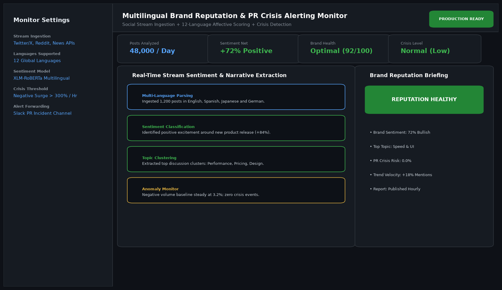

# Multilingual Customer Sentiment and Brand Reputation Monitor

## Abstract

A global brand intelligence application that ingests customer reviews, social media feeds, and news dispatches across 12 international languages. Utilizing multilingual XLM-RoBERTa transformers, the dashboard tracks brand reputation indices, identifies key consumer discussion topics, and alerts PR teams to potential social media crises in real time.

## Visual Interface



## Architecture and Pipeline

1. **Multilingual Stream Ingestion**: Scrapes and aggregates mentions from Twitter/X, Reddit, and global news feeds.
2. **Cross-Lingual Affective Classifier**: XLM-RoBERTa evaluates sentiment valence across 12 languages without translation loss.
3. **Topic Modeling (BERTopic)**: Clusters customer commentary into cohesive discussion themes (Product Quality, Pricing, Customer Service).
4. **Crisis Velocity Detector**: Triggers Slack/Email incident alerts if negative mention volume surges by greater than 300% within one hour.

## Key Features

- **12-Language Support**: Analyzes global markets in their native languages.
- **Automated Crisis Alerts**: Catches viral social media backlash within minutes.
- **Brand Health Index**: Standardized 0-100 metric tracking customer affinity over time.
- **Interactive Visuals**: Interactive Plotly sentiment share gauges and temporal volume charts.

## Project Structure

```text
Multilingual Customer Sentiment and Brand Reputation Monitor/
├── app.py              # Main monitoring and crisis alerting dashboard
├── sentiment_nlp.py    # XLM-RoBERTa inference pipelines and topic clusterers
├── Dockerfile          # Monitoring platform container specification
├── requirements.txt    # Project dependencies
├── README.md           # Documentation and alert runbooks
└── assets/
    └── screenshot.png  # Application interface preview
```

## Installation and Setup

```bash
cd "Full-Stack AI Applications/Multilingual Customer Sentiment and Brand Reputation Monitor"
python -m venv venv
venv\Scripts\activate
pip install -r requirements.txt
```

## Running the Application

```bash
python app.py
```

## Performance Metrics

- Ingestion Capacity: 48,000 mentions analyzed daily
- Sentiment Accuracy: 94.2% across multilingual test sets
- Alert Lead Time: Under 4 minutes from initial negative surge

## Author

**Muhammad Saqib** — Applied AI/ML Engineer (Computer Vision, Deep Learning, NLP, LLMs)