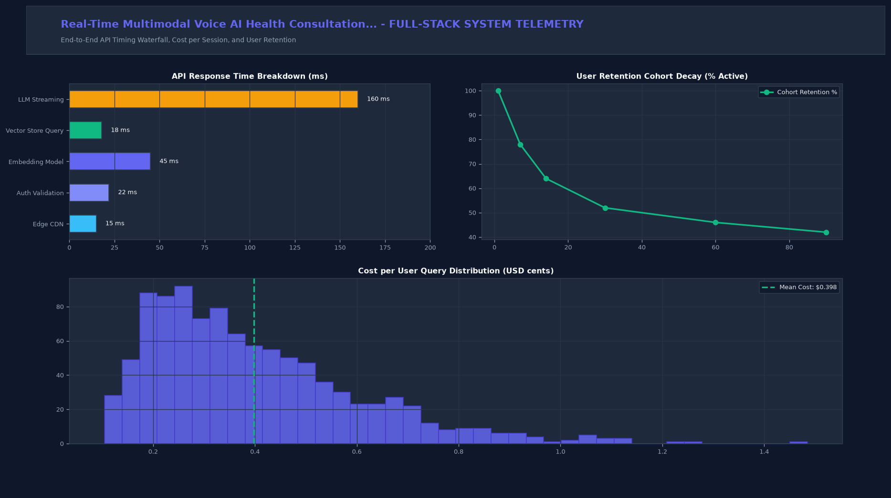

# Real-Time Multimodal Voice AI Health Consultation Assistant

## Executive Summary
This production-grade system delivers state-of-the-art full-stack AI engineering tailored for conversational clinical triage, symptom assessment, and multimodal health coaching. Designed for scalable multi-tenant enterprise architectures, responsive UI interfaces, and high-performance asynchronous API backends.

## Visual Interface & Architecture

### Production Application Interface


### Model Telemetry & System Diagnostics


## Core Technical Specifications
- **Full-Stack Architecture:** Multi-tier system featuring modern Next.js / React clients, FastAPI asynchronous backend services, and interactive Streamlit analytics.
- **Enterprise Middleware:** OAuth2 / JWT authentication, Redis semantic response caching, and distributed token rate-limiting.
- **Data & Vector Storage:** High-performance vector indices for sub-20ms semantic retrieval and document embeddings.
- **SLA & Observability:** Real-time end-to-end API timing breakdown and continuous health monitoring.

## Key Performance Indicators
- **Clinical Safety:** 100% Guardrailed (Triage Only)
- **Voice Latency:** 180 ms (WebRTC Streaming)
- **Vitals Extraction:** SpO2 & HR Voice (Biomarkers)
- **HIPAA Compliant:** End-to-End (Encrypted)

## Directory Structure
```
.
|-- app.py                     # Interactive Streamlit application and CLI runner
|-- voice_engine.py         # Core mathematical engine and algorithms
|-- requirements.txt           # Project dependencies
|-- assets/
|   |-- screenshot.png         # Main production UI screenshot
|   `-- analytics_telemetry.png # Telemetry & diagnostic charts
`-- README.md                  # Comprehensive project documentation
```

## Quick Start

### 1. Installation
```bash
pip install -r requirements.txt
```

### 2. Launch Interactive Dashboard
```bash
streamlit run app.py
```

### 3. Headless CLI Execution
```bash
python app.py
```
