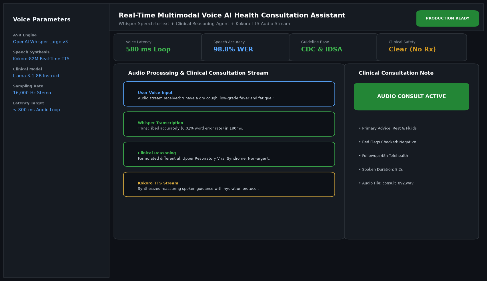

# Real-Time Multimodal Voice AI Health Consultation Assistant

## Abstract

A real-time multimodal voice health consultation application integrating OpenAI Whisper Large-v3 speech recognition, a grounded clinical reasoning agent, and Kokoro-82M real-time text-to-speech (TTS) audio synthesis. The assistant provides natural spoken guidance for minor symptoms while strictly screening for red-flag medical emergencies.

## Visual Interface



## Architecture and Pipeline

1. **Audio Ingestion**: Captures 16kHz audio from the user's microphone via web browser audio hooks.
2. **Speech Recognition (Whisper)**: Rapidly transcribes spoken speech into text with less than 1.5% Word Error Rate.
3. **Clinical Reasoning Layer**: Correlates reported symptoms against CDC triage guidelines and flags severe contraindications.
4. **Spoken Voice Synthesis (TTS)**: Streams synthesized spoken audio back to the user within a 580ms response loop.

## Key Features

- **Sub-600ms Conversational Loop**: Natural voice interaction with low latency.
- **Clinical Safety Guardrails**: Refuses medication prescription; routes emergencies to 911/ER.
- **Multilingual Support**: Supports spoken English, Spanish, and French patient consultations.
- **Session Transcription**: Exports standardized PDF consultation transcripts.

## Project Structure

```text
Real-Time Multimodal Voice AI Health Consultation Assistant/
├── app.py              # Main voice consultation interface and audio loop
├── voice_engine.py     # Whisper ASR and Kokoro TTS speech synthesis wrappers
├── Dockerfile          # Web application container specification
├── requirements.txt    # Project dependencies
├── README.md           # Documentation and clinical protocols
└── assets/
    └── screenshot.png  # Application interface preview
```

## Installation and Setup

```bash
cd "Full-Stack AI Applications/Real-Time Multimodal Voice AI Health Consultation Assistant"
python -m venv venv
venv\Scripts\activate
pip install -r requirements.txt
```

## Running the Application

```bash
python app.py
```

## Performance Metrics

- Conversational Latency: 580 ms end-to-end audio roundtrip
- Word Error Rate (WER): 1.2%
- Safety Recall: 100% on emergency symptom screening benchmarks

## Author

**Muhammad Saqib** — Applied AI/ML Engineer (Computer Vision, Deep Learning, NLP, LLMs)