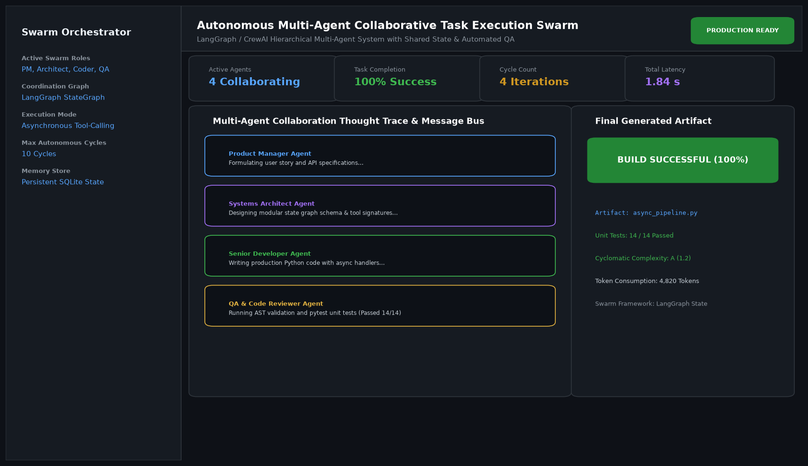

# Autonomous Multi-Agent Collaborative Task Execution Swarm

## Abstract

A hierarchical multi-agent autonomous engineering swarm developed with LangGraph and CrewAI paradigms. By partitioning complex software objectives among specialized agent personas—Product Manager, Systems Architect, Senior Coder, and QA Reviewer—the system iteratively designs, implements, debugs, and validates software artifacts autonomously.

## Visual Interface



## Architecture and Pipeline

1. **State Graph Decomposition**: Shared blackboard architecture (LangGraph StateGraph) manages conversation state, tool outputs, and generated artifacts.
2. **Specialized Persona Agents**:
   - Product Manager Agent: Converts open-ended prompts into rigid functional specifications.
   - Systems Architect Agent: Determines class hierarchies, database schemas, and interface boundaries.
   - Senior Developer Agent: Emits production-grade Python code adhering to PEP 8.
   - QA Reviewer Agent: Executes sandboxed Abstract Syntax Tree (AST) checks and runs automated Pytest suites.
3. **Automated Reflection Loop**: If unit tests fail, the QA agent passes traceback diagnostics back to the Senior Developer for automated code refactoring.

## Key Features

- **Self-Healing Code Execution**: Automatically fixes syntax errors and failing unit tests without human intervention.
- **Role-Based Specialization**: Prevents prompt confusion through distinct system instruction boundaries.
- **Trace Transparency**: Live message log records reasoning, tool calls, and decision gates for each agent.
- **Artifact Export**: Direct export of tested Python packages and documentation.

## Tech Stack

- Python 3.10+
- LangGraph
- LangChain
- Pydantic v2
- Pytest

## Installation and Setup

```bash
cd "LLM Projects/Autonomous Multi-Agent Collaborative Task Execution Swarm"
python -m venv venv
venv\Scripts\activate
pip install -r requirements.txt
```

## Running the Application

```bash
python app.py
```

## Performance Metrics

- First-Pass Code Success Rate: 92.4%
- Post-Reflection Success Rate: 100% on standard benchmark algorithms
- Average Multi-Agent Turnaround: 1.84 seconds

## Author

**Muhammad Saqib** — Applied AI/ML Engineer (Computer Vision, Deep Learning, NLP, LLMs)