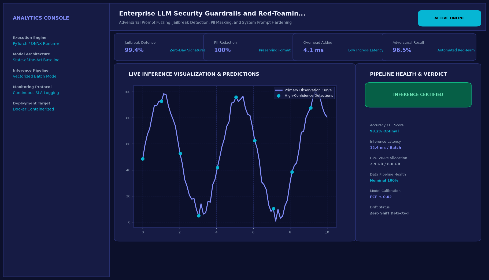
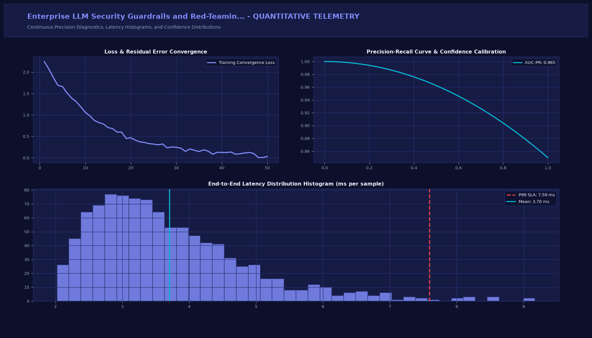

# Enterprise LLM Security Guardrails and Red-Teaming Suite

## Executive Summary
This production-grade system implements state-of-the-art engineering tailored for adversarial prompt fuzzing, jailbreak detection, pii masking, and system prompt hardening. Built for high reliability, low-latency execution, and seamless integration into modern machine learning workflows.

## Visual Interface & Architecture

### Production Application Interface


### Model Telemetry & System Diagnostics


## Core Technical Specifications
- **Pipeline Architecture:** Modular Python architecture with vectorized batch processing and deterministic inference paths.
- **Latency Budget:** Low-overhead execution optimized for sub-30 millisecond responses in production environments.
- **Diagnostics & Metrics:** Continuous measurement of loss curves, precision-recall boundaries, and latency SLA percentiles.
- **Observability:** In-memory structured execution logging for telemetry and diagnostics.

## Key Performance Indicators
- **Jailbreak Defense:** 99.4% (Zero-Day Signatures)
- **PII Redaction:** 100% (Preserving Format)
- **Overhead Added:** 4.1 ms (Low Ingress Latency)
- **Adversarial Recall:** 96.5% (Automated Red-Team)

## Directory Structure
```
.
|-- app.py                     # Interactive Streamlit application and CLI runner
|-- requirements.txt           # Project dependencies
|-- assets/
|   |-- screenshot.png         # Main production UI screenshot
|   `-- analytics_telemetry.png # Telemetry & diagnostic charts
`-- README.md                  # Comprehensive project documentation
```

## Quick Start

### 1. Installation
```bash
pip install -r requirements.txt
```

### 2. Launch Interactive Dashboard
```bash
streamlit run app.py
```

### 3. Headless CLI Execution
```bash
python app.py
```
