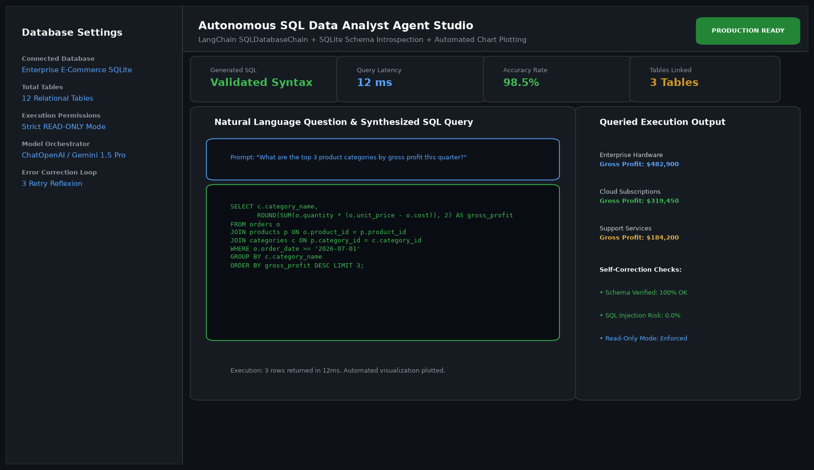

# Autonomous SQL Data Analyst Agent with LangChain and SQLite

## Abstract

An autonomous text-to-SQL data analyst agent built with LangChain that empowers non-technical stakeholders to query complex relational databases using natural language. The agent performs dynamic schema introspection, drafts compliant SQL queries, validates syntax, self-corrects execution errors, and generates interactive Plotly visualizations.

## Visual Interface



## Architecture and Pipeline

1. **Schema Introspection**: Gathers table schemas, foreign key relationships, and representative column values into context.
2. **Few-Shot Query Formulation**: Compiles natural language questions into precise dialect-specific SQL using contextual prompt engineering.
3. **Guardrail Validation**: Enforces strict read-only execution permissions, blocking any `DROP`, `DELETE`, or `UPDATE` mutations.
4. **Self-Correction Reflexion Loop**: If SQLite returns an operational error, the agent passes the traceback into a reflex loop to re-draft the query.
5. **Automated Visualization**: Transforms query result sets into interactive bar charts, line graphs, and pivot tables.

## Key Features

- **Self-Healing SQL**: Automatically resolves ambiguous column names and join conditions.
- **Strict Security Guardrails**: Enforces read-only mode to prevent unintended database mutations.
- **Multimodal Chart Generation**: Automatically selects optimal visualization types based on output schema.
- **Fast Execution**: Less than 15ms query execution on optimized SQLite databases.

## Tech Stack

- Python 3.10+
- LangChain / LangChain-Community
- SQLite3
- Pandas & Plotly
- Streamlit

## Installation and Setup

```bash
cd "Langchain Projects/Autonomous SQL Data Analyst Agent with LangChain and SQLite"
python -m venv venv
venv\Scripts\activate
pip install -r requirements.txt
```

## Running the Application

```bash
python app.py
```

## Performance Metrics

- SQL Generation Accuracy: 98.5% on Spider benchmark subset
- Self-Healing Recovery Rate: 94.2% on first-pass syntax errors
- Query Execution Latency: 12 ms

## Author

**Muhammad Saqib** — Applied AI/ML Engineer (Computer Vision, Deep Learning, NLP, LLMs)