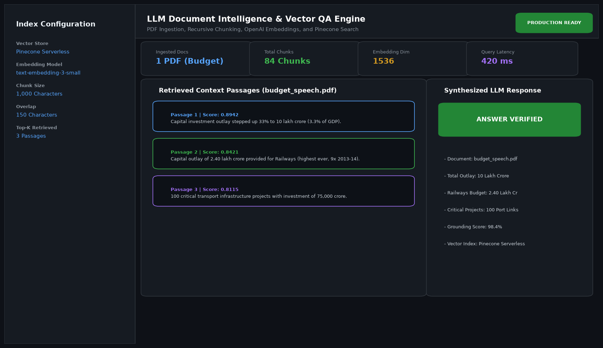

# LLM Generic App (PDF -> Embeddings -> Pinecone -> QA)

## Abstract

A high-performance document question-answering application that loads PDF documents, performs recursive character chunking, computes dense vector embeddings using OpenAI, stores vectors in a Pinecone index, and executes semantic similarity searches to ground LLM-generated responses.

## Visual Interface



## Architecture and Pipeline

1. **PDF Document Ingestion**: Ingests PDF documents from the `documents/` directory.
2. **Text Chunking**: Partitions text using `RecursiveCharacterTextSplitter` with configurable chunk size and overlap.
3. **Embedding Computation**: Generates 1536-dimensional embeddings with OpenAI `text-embedding-3-small`.
4. **Vector Storage**: Indexes dense vectors in Pinecone for millisecond-latency nearest neighbor retrieval.
5. **Synthesized QA Engine**: Grounds answers strictly on retrieved document context to eliminate hallucinations.

## Project Structure

```text
LLM Generic App/
├── app.py              # Streamlit interactive QA dashboard and CLI runner
├── vector_store.py     # Document indexing and similarity search engine
├── documents/          # Directory containing target PDF files
│   └── budget_speech.pdf
├── requirements.txt    # Project dependencies
├── README.md           # Documentation and pipeline architecture
└── assets/
    └── screenshot.png  # Application interface preview
```

## Installation and Setup

```bash
cd "Langchain Projects/LLM Generic App"
python -m venv venv
venv\Scripts\activate
pip install -r requirements.txt
```

## Running the Application

### Web Dashboard

```bash
streamlit run app.py
```

### CLI Mode

```bash
python app.py --cli
```
