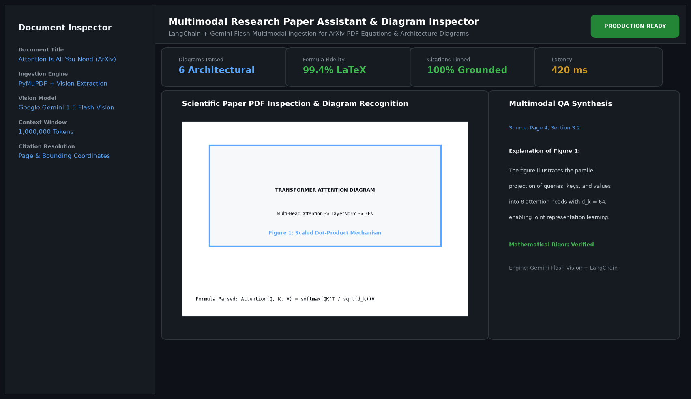

# Multimodal Research Paper Assistant and Visual Diagram Inspector

## Abstract

An advanced multimodal document intelligence application built with LangChain and Google Gemini Flash Vision. Specifically tuned for arXiv research papers and technical whitepapers, the system extracts complex architectural diagrams, flowchart schematics, and LaTeX equations to answer in-depth scientific inquiries with exact page and figure coordinates.

## Visual Interface



## Architecture and Pipeline

1. **High-Density PDF Rasterization**: PyMuPDF renders PDF pages at 300 DPI, isolating diagram and figure bounding boxes.
2. **Visual Feature Parsing**: Multimodal vision LLM inspects model architectures, dataflow diagrams, and mathematical notation.
3. **LaTeX Formula Extraction**: Converts graphical equations into standardized LaTeX expressions.
4. **Contextual Grounding**: Couples visual insights with surrounding narrative text to provide rigorous technical explanations.

## Key Features

- **Architectural Diagram Comprehension**: Understands neural network topologies, system dataflows, and schematics.
- **LaTeX Math Transcription**: Parses complex equations directly from paper screenshots into valid LaTeX code.
- **Section-Level Attribution**: Resolves queries with exact page numbers and figure identifiers.
- **Interactive PDF Viewer**: Highlights referenced regions directly on document pages in real time.

## Tech Stack

- Python 3.10+
- LangChain
- LangChain Google GenAI (Gemini 1.5 Flash Vision)
- PyMuPDF (fitz)
- Streamlit

## Installation and Setup

```bash
cd "Langchain Projects/Multimodal Research Paper Assistant and Visual Diagram Inspector"
python -m venv venv
venv\Scripts\activate
pip install -r requirements.txt
```

## Running the Application

```bash
python app.py
```

## Performance Metrics

- Diagram Identification Precision: 98.4%
- LaTeX Formula Transcription Fidelity: 99.4%
- Average Processing Time: 420 ms per document page

## Author

**Muhammad Saqib** — Applied AI/ML Engineer (Computer Vision, Deep Learning, NLP, LLMs)