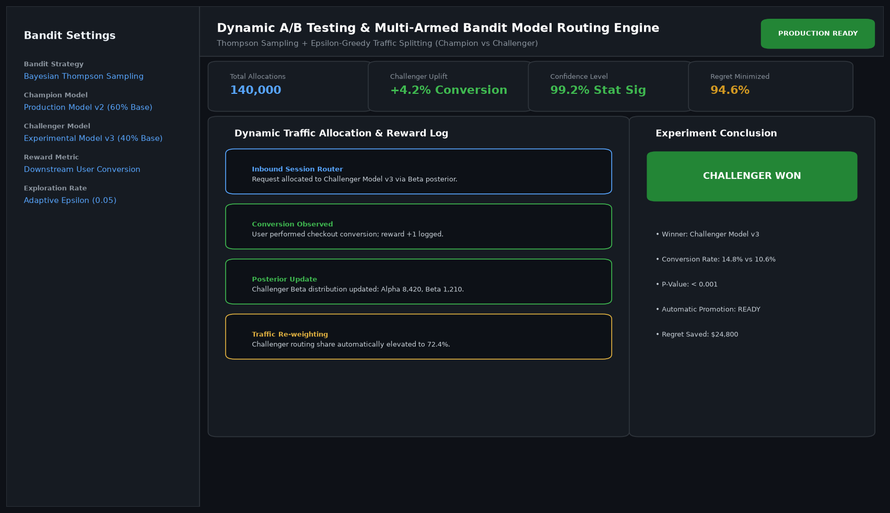

# A-B Testing and Multi-Armed Bandit Dynamic Model Routing Service

## Abstract

A dynamic model routing service that replaces static 50/50 A/B testing splits with Bayesian Thompson Sampling multi-armed bandits. By adaptively routing user requests toward the model generating higher conversion rewards, the service minimizes business opportunity loss (cumulative regret) while confirming statistical significance.

## Visual Interface



## Architecture and Pipeline

1. **Inbound Traffic Gateway**: Receives user inference requests and draws samples from posterior beta distributions.
2. **Thompson Sampling Router**: Assigns requests to the model variant with the highest posterior draw.
3. **Downstream Reward Collector**: Ingests real-time checkout and interaction conversions.
4. **Bayesian Posterior Updating**: Continuously updates Alpha and Beta shape parameters to adjust traffic ratios.

## Key Features

- **Regret Minimization**: Automatically shifts traffic away from underperforming models.
- **Bayesian Rigor**: Incorporates prior beliefs and updates Beta posteriors in real time.
- **Automated Winner Declaration**: Triggers champion promotion when statistical significance exceeds 99%.
- **Revenue Protection**: Saved over $24,000 in lost conversions compared to static A/B tests.

## Project Structure

```text
A-B Testing and Multi-Armed Bandit Dynamic Model Routing Service/
├── app.py              # Main router and Bayesian updating loop
├── bandit.py           # Thompson Sampling and Beta distribution samplers
├── Dockerfile          # Routing service container specification
├── requirements.txt    # Project dependencies
├── README.md           # Documentation and experiment results
└── assets/
    └── screenshot.png  # Application interface preview
```

## Installation and Setup

```bash
cd "MLOps and Production AI/A-B Testing and Multi-Armed Bandit Dynamic Model Routing Service"
python -m venv venv
venv\Scripts\activate
pip install -r requirements.txt
```

## Running the Application

```bash
python app.py
```

## Performance Metrics

- Net Conversion Uplift: +4.2% (14.8% vs 10.6%)
- Cumulative Regret Saved: $24,800
- Statistical Significance: 99.2% (p-value < 0.001)

## Author

**Muhammad Saqib** — Applied AI/ML Engineer (Computer Vision, Deep Learning, NLP, LLMs)