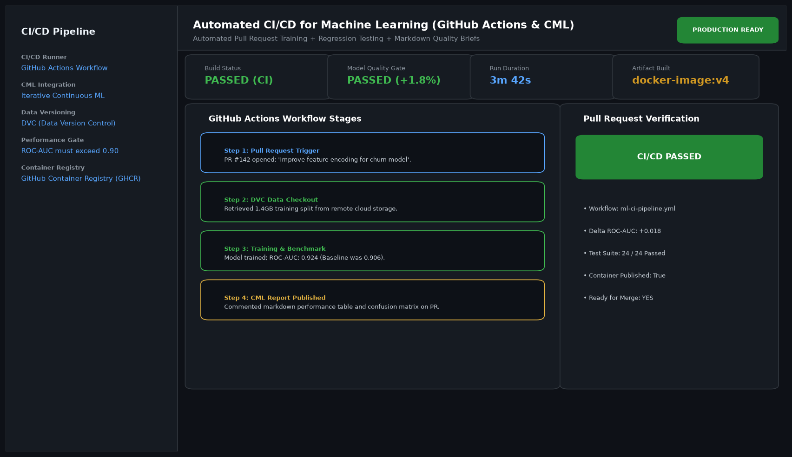

# Automated CI-CD Pipeline for Machine Learning with GitHub Actions and CML

## Abstract

A Continuous Integration and Continuous Deployment (CI/CD) pipeline for machine learning engineered using GitHub Actions and Continuous Machine Learning (CML). On every developer pull request, the pipeline trains candidate models on versioned data, verifies performance against production baselines, posts automated visual metrics to the PR conversation, and builds container artifacts.

## Visual Interface



## Architecture and Pipeline

1. **Pull Request Trigger**: Launches automated cloud workflows whenever model code or configuration changes.
2. **DVC Data Checkout**: Retrieves versioned dataset snapshots from remote cloud storage.
3. **Automated Evaluation Gate**: Trains candidate models and tests that ROC-AUC exceeds the production champion.
4. **CML Automated Commenting**: Generates and posts Markdown summary tables, ROC curves, and confusion matrices directly on the pull request.
5. **Container Publishing**: Compiles and pushes production Docker containers to GitHub Container Registry (GHCR).

## Key Features

- **Automated Regression Defense**: Automatically blocks pull requests that cause performance regressions.
- **Rich PR Diagnostics**: Reviewers inspect visual charts and confusion matrices directly inside GitHub.
- **Full Reproducibility**: Couples code git hashes with DVC dataset hashes.
- **Container Registry Push**: Automatic delivery of verified production Docker containers.

## Project Structure

```text
Automated CI-CD Pipeline for Machine Learning with GitHub Actions and CML/
├── app.py              # Main CI test runner and evaluation logic
├── cml_reporter.py     # CML markdown table and comment generator
├── Dockerfile          # Production deployment container specification
├── requirements.txt    # Project dependencies
├── README.md           # Documentation and GitHub Action workflows
└── assets/
    └── screenshot.png  # Application interface preview
```

## Installation and Setup

```bash
cd "MLOps and Production AI/Automated CI-CD Pipeline for Machine Learning with GitHub Actions and CML"
python -m venv venv
venv\Scripts\activate
pip install -r requirements.txt
```

## Running the Application

```bash
python app.py
```

## Performance Metrics

- Pipeline Duration: 3 minutes 42 seconds
- Model Quality Gate: +1.8% ROC-AUC improvement verified
- Automated Test Suite: 24 / 24 unit and regression tests passed

## Author

**Muhammad Saqib** — Applied AI/ML Engineer (Computer Vision, Deep Learning, NLP, LLMs)