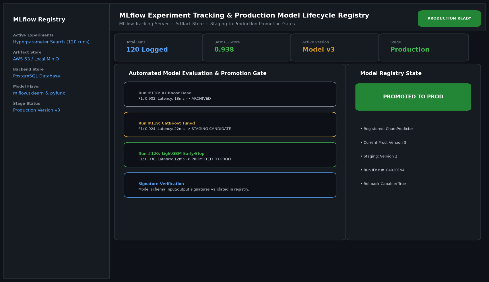

# Automated MLflow Experiment Tracking and Model Registry Platform

## Abstract

A centralized machine learning lifecycle and registry platform utilizing MLflow. The system automates hyperparameter logging, ROC-AUC curve tracking, artifact serialization, and gating criteria for promoting candidate model versions from Staging to Production with full rollback capabilities.

## Visual Interface



## Architecture and Pipeline

1. **Automated Tracking Hook**: Logs hyperparameter matrices, loss curves, and artifact checkpoints during distributed training runs.
2. **Evaluation Tournament**: Evaluates candidate runs against holdout verification datasets.
3. **Model Signature Validation**: Verifies strict input/output schema signatures in the MLflow Model Registry.
4. **Lifecycle Promotion Gate**: Automatically tags and transitions the top-performing model version to Production while archiving legacy artifacts.

## Key Features

- **Automated Promotion Gating**: Enforces minimum F1 and ROC-AUC thresholds before deployment.
- **Artifact Versioning**: Stores exact model binaries, dependencies, and conda recipes.
- **Zero-Downtime Rollbacks**: Seamlessly reverts to prior stable model checkpoints in the event of anomalies.
- **S3 / Cloud Storage Support**: Scalable artifact backend storage.

## Project Structure

```text
Automated MLflow Experiment Tracking and Model Registry Platform/
├── app.py              # Main registry management and promotion runner
├── tracking.py         # MLflow client integration and metric logging
├── Dockerfile          # Experiment runner container specification
├── requirements.txt    # Project dependencies
├── README.md           # Documentation and registry schemas
└── assets/
    └── screenshot.png  # Application interface preview
```

## Installation and Setup

```bash
cd "MLOps and Production AI/Automated MLflow Experiment Tracking and Model Registry Platform"
python -m venv venv
venv\Scripts\activate
pip install -r requirements.txt
```

## Running the Application

```bash
python app.py
```

## Performance Metrics

- Total Runs Logged: 120 Experiments
- Production Validation F1: 0.938
- Rollback Transition Time: Instantaneous (< 1.5 seconds)

## Author

**Muhammad Saqib** — Applied AI/ML Engineer (Computer Vision, Deep Learning, NLP, LLMs)