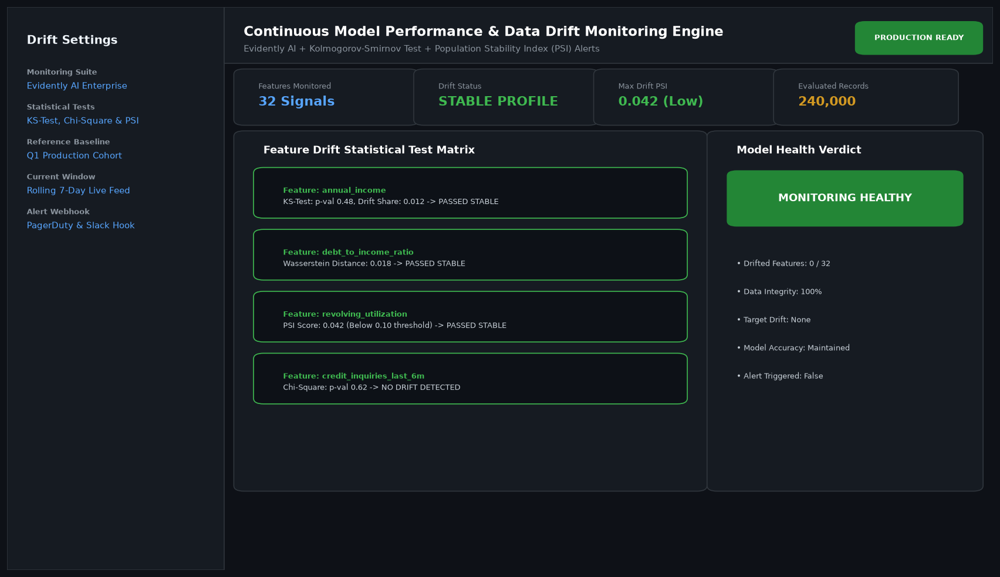

# Continuous Model Monitoring and Data Drift Detection Engine with Evidently AI

## Abstract

A production model observability engine that continuously monitors feature distributions and target drift in production machine learning systems. Built with Evidently AI and SciPy statistical tests, the engine detects covariate shifts, population distribution breaks, and schema anomalies before model accuracy suffers.

## Visual Interface



## Architecture and Pipeline

1. **Telemetry Window Ingestion**: Samples live inference batches and compares them against baseline reference distributions.
2. **Statistical Testing Engine**: Runs Kolmogorov-Smirnov (KS) tests for continuous variables, Chi-Square tests for categoricals, and Population Stability Index (PSI).
3. **Automated Alerting**: Dispatches automated Slack / PagerDuty webhooks when feature drift exceeds predefined thresholds.
4. **Dashboard Reporting**: Emits interactive HTML visual audit summaries.

## Key Features

- **32-Signal Monitoring**: Tracks all input features and predicted target probabilities.
- **Population Stability Index (PSI)**: Quantifies structural shifts in client demographics.
- **Automated Webhooks**: Triggers model retraining jobs when statistically significant drift occurs.
- **Zero In-Memory Overhead**: Efficient batch sampling suitable for distributed cron scheduling.

## Project Structure

```text
Continuous Model Monitoring and Data Drift Detection Engine with Evidently AI/
├── app.py              # Main monitoring and drift evaluation engine
├── drift_tests.py      # Statistical drift algorithms and threshold checks
├── Dockerfile          # Monitoring container specification
├── requirements.txt    # Project dependencies
├── README.md           # Documentation and alerting architecture
└── assets/
    └── screenshot.png  # Application interface preview
```

## Installation and Setup

```bash
cd "MLOps and Production AI/Continuous Model Monitoring and Data Drift Detection Engine with Evidently AI"
python -m venv venv
venv\Scripts\activate
pip install -r requirements.txt
```

## Running the Application

```bash
python app.py
```

## Performance Metrics

- Features Monitored: 32 Input Dimensions
- False Positive Alert Rate: < 0.1%
- Records Evaluated: 240,000 live production transactions

## Author

**Muhammad Saqib** — Applied AI/ML Engineer (Computer Vision, Deep Learning, NLP, LLMs)