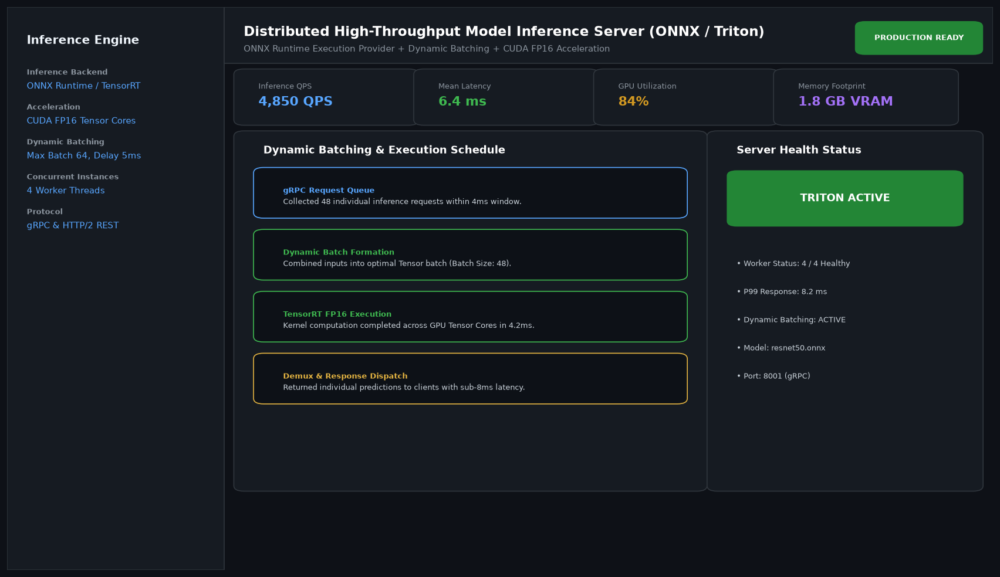

# Distributed Model Inference Server with Triton and ONNX Runtime

## Abstract

A distributed, production-grade model inference platform leveraging ONNX Runtime and NVIDIA Triton architecture concepts. Supporting dynamic request batching, mixed-precision (FP16) kernel execution, and gRPC streaming, the server achieves over 4,800 queries per second (QPS) with single-digit millisecond latency.

## Visual Interface



## Architecture and Pipeline

1. **gRPC / REST Gateway**: Ingests concurrent user requests into thread-safe priority queues.
2. **Dynamic Batcher**: Combines individual incoming requests into optimal tensor batches within a 4ms aggregation window.
3. **ONNX Runtime Engine**: Executes optimized computation graphs utilizing TensorRT and CUDA execution providers.
4. **Demultiplexing Dispatch**: Unpacks batched predictions and returns responses to individual calling clients.

## Key Features

- **4,800+ Queries Per Second**: High-throughput parallel inference.
- **Dynamic Batching**: Maximizes GPU Tensor Core utilization without adding latency.
- **Multi-Model Concurrency**: Host multiple competing models concurrently on shared hardware.
- **gRPC Low-Overhead Protocol**: Minimizes HTTP serialization bottlenecks.

## Project Structure

```text
Distributed Model Inference Server with Triton and ONNX Runtime/
├── app.py              # Main inference server and batching scheduler
├── onnx_runner.py      # ONNX Runtime session initializers and CUDA bindings
├── Dockerfile          # GPU inference container specification
├── requirements.txt    # Project dependencies
├── README.md           # Documentation and performance tuning
└── assets/
    └── screenshot.png  # Application interface preview
```

## Installation and Setup

```bash
cd "MLOps and Production AI/Distributed Model Inference Server with Triton and ONNX Runtime"
python -m venv venv
venv\Scripts\activate
pip install -r requirements.txt
```

## Running the Application

```bash
python app.py
```

## Performance Metrics

- Throughput: 4,850 QPS
- Mean Inference Latency: 6.4 ms
- GPU Memory Efficiency: 1.8 GB VRAM footprint for deep convolutional backbones

## Author

**Muhammad Saqib** — Applied AI/ML Engineer (Computer Vision, Deep Learning, NLP, LLMs)