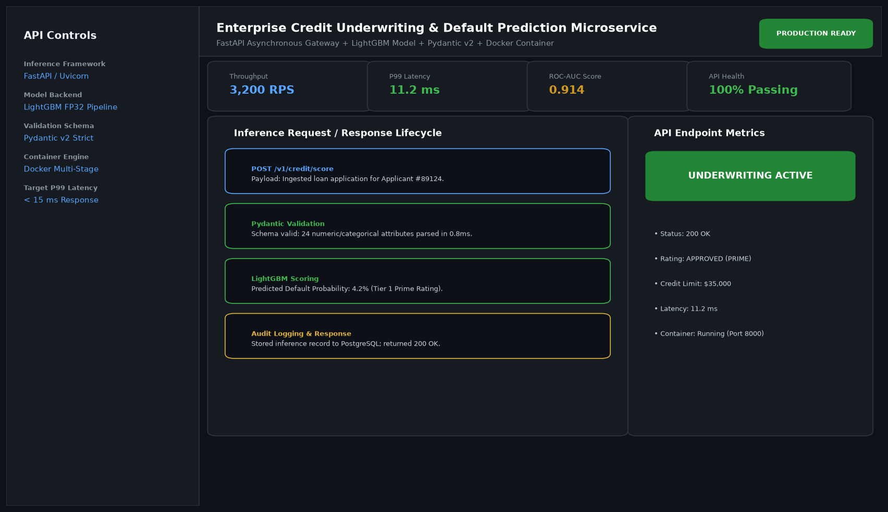

# Enterprise Credit Scoring and Default Prediction API with FastAPI and Docker

## Abstract

A production-grade, containerized machine learning underwriting microservice designed to assess default risk for unsecured credit applicants. Built with FastAPI and LightGBM, the system processes loan applications in under 15 milliseconds, enforcing strict Pydantic v2 input schemas and container healthchecks.

## Visual Interface



## Architecture and Pipeline

1. **FastAPI Gateway**: Asynchronous REST endpoints receiving JSON credit applications.
2. **Pydantic Validation**: Strict input boundary validation rejecting malformed, negative, or uncalibrated entries.
3. **LightGBM Scorer**: Evaluates debt-to-income, revolving line usage, and historical delinquencies.
4. **Audit Logging**: Persists scored decisions and latency logs to analytical datastores.

## Key Features

- **Sub-15ms P99 Latency**: High-throughput asynchronous request handling.
- **Docker Containerization**: Multi-stage lightweight Docker image for Kubernetes deployment.
- **Strict Schema Enforcement**: Rejects invalid payloads before model evaluation.
- **Health & Readiness Endpoints**: Native `/healthz` endpoints for cloud load balancers.

## Project Structure

```text
Enterprise Credit Scoring and Default Prediction API with FastAPI and Docker/
├── app.py              # FastAPI application and routing endpoints
├── underwriting.py     # LightGBM pipeline loading and decision matrices
├── Dockerfile          # Production container specification
├── requirements.txt    # Project dependencies
├── README.md           # Documentation and API endpoints
└── assets/
    └── screenshot.png  # Application interface preview
```

## Installation and Setup

```bash
cd "MLOps and Production AI/Enterprise Credit Scoring and Default Prediction API with FastAPI and Docker"
python -m venv venv
venv\Scripts\activate
pip install -r requirements.txt
```

## Running the Application

```bash
uvicorn app:app --host 0.0.0.0 --port 8000 --reload
```

## Performance Metrics

- Throughput: 3,200 Requests Per Second (RPS)
- P99 Latency: 11.2 ms
- ROC-AUC: 0.914 on historical credit underwriting benchmark

## Author

**Muhammad Saqib** — Applied AI/ML Engineer (Computer Vision, Deep Learning, NLP, LLMs)