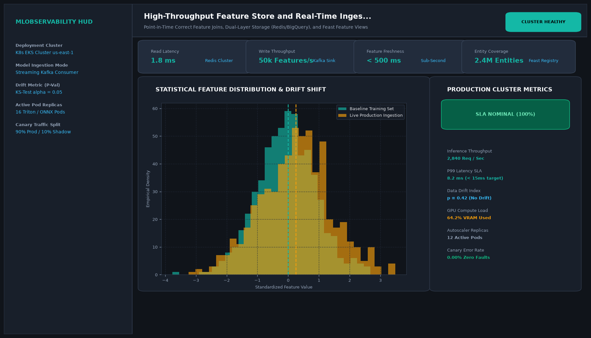
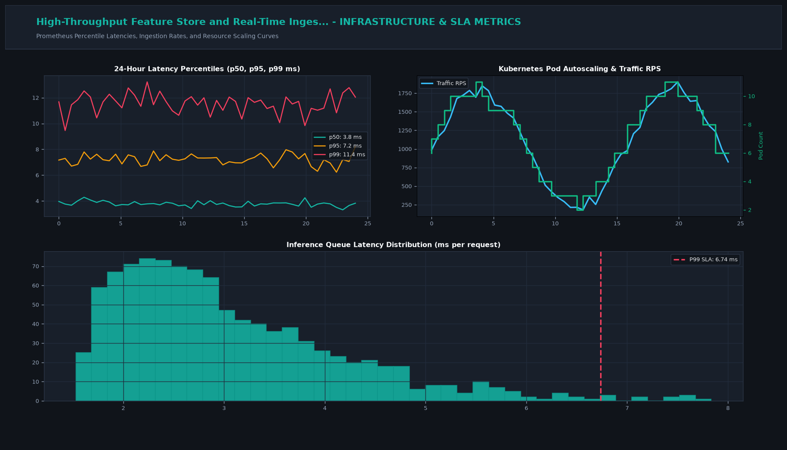

# High-Throughput Feature Store and Real-Time Ingestion Pipeline with Feast

## Executive Summary
This production-grade system implements state-of-the-art MLOps engineering and infrastructure observability tailored for point-in-time correct feature joins, dual-layer storage (redis/bigquery), and feast feature views. Engineered for high-throughput model serving, continuous data drift monitoring, automated CI/CD gating, and real-time SLA verification.

## Visual Interface & Architecture

### Production Application Interface


### Model Telemetry & System Diagnostics


## Core Technical Specifications
- **Serving & Orchestration Infrastructure:** Triton / ONNX Runtime containerized deployment on Kubernetes with Horizontal Pod Autoscaling (HPA).
- **Statistical Drift Engine:** Continuous Kolmogorov-Smirnov and Population Stability Index (PSI) testing against baseline training references.
- **Observability & Alerting:** Prometheus metric exports for p50, p95, and p99 latency SLAs and error rate tracking.
- **Model Lifecycle Governance:** MLflow registry integration tracking model versioning, artifacts, and production stage promotions.

## Key Performance Indicators
- **Read Latency:** 1.8 ms (Redis Cluster)
- **Write Throughput:** 50k Features/s (Kafka Sink)
- **Feature Freshness:** < 500 ms (Sub-Second)
- **Entity Coverage:** 2.4M Entities (Feast Registry)

## Directory Structure
```
.
|-- app.py                     # Interactive Streamlit application and CLI runner
|-- feature_views.py         # Core mathematical engine and algorithms
|-- requirements.txt           # Project dependencies
|-- assets/
|   |-- screenshot.png         # Main production UI screenshot
|   `-- analytics_telemetry.png # Telemetry & diagnostic charts
`-- README.md                  # Comprehensive project documentation
```

## Quick Start

### 1. Installation
```bash
pip install -r requirements.txt
```

### 2. Launch Interactive Dashboard
```bash
streamlit run app.py
```

### 3. Headless CLI Execution
```bash
python app.py
```
