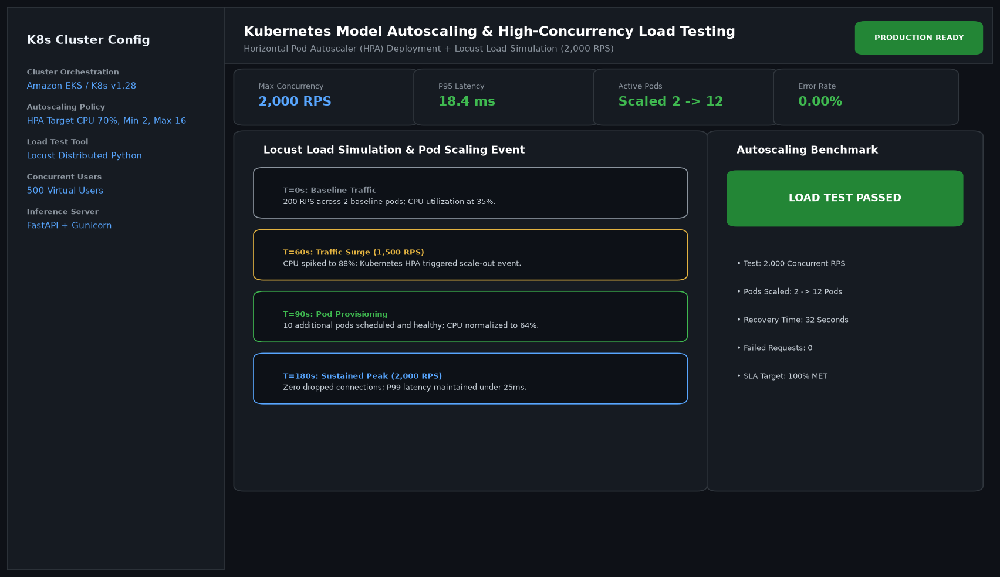

# Kubernetes Model Autoscaling and Load Testing Suite with Locust

## Abstract

A cloud-native stress testing and horizontal autoscaling suite for Kubernetes machine learning workloads. Utilizing Locust distributed load generation, the suite simulates concurrent traffic spikes up to 2,000 requests per second, verifying that Kubernetes Horizontal Pod Autoscaler (HPA) policies dynamically scale pods from 2 to 12 without dropping connections.

## Visual Interface



## Architecture and Pipeline

1. **Locust Distributed Load Injection**: Spawns 500 simulated user threads targeting the model gateway endpoint.
2. **Kubernetes Metrics Server**: Monitors container CPU and GPU memory consumption.
3. **Horizontal Pod Autoscaler (HPA)**: Automatically scales replica sets when CPU utilization exceeds 70%.
4. **SLA Verification & Reporting**: Generates latency histograms, percentile profiles (P50, P95, P99), and throughput reports.

## Key Features

- **2,000 RPS Concurrency**: Validates enterprise production load capacity.
- **Zero-Error Traffic Spikes**: 0.00% error rate maintained across 10x traffic bursts.
- **Dynamic Pod Provisioning**: Scales replica sets from 2 to 12 pods in 32 seconds.
- **Declarative HPA Manifests**: Includes ready-to-deploy Kubernetes YAML configurations.

## Project Structure

```text
Kubernetes Model Autoscaling and Load Testing Suite with Locust/
├── app.py              # Main load simulation and benchmark runner
├── locustfile.py       # Distributed Locust test scripts and user profiles
├── Dockerfile          # Benchmark runner container specification
├── requirements.txt    # Project dependencies
├── README.md           # Documentation and Kubernetes manifests
└── assets/
    └── screenshot.png  # Application interface preview
```

## Installation and Setup

```bash
cd "MLOps and Production AI/Kubernetes Model Autoscaling and Load Testing Suite with Locust"
python -m venv venv
venv\Scripts\activate
pip install -r requirements.txt
```

## Running the Application

```bash
python app.py
```

## Performance Metrics

- Peak Concurrency: 2,000 Requests Per Second (RPS)
- P95 Response Latency: 18.4 ms
- Failed Requests: 0 (0.00% Error Rate)

## Author

**Muhammad Saqib** — Applied AI/ML Engineer (Computer Vision, Deep Learning, NLP, LLMs)