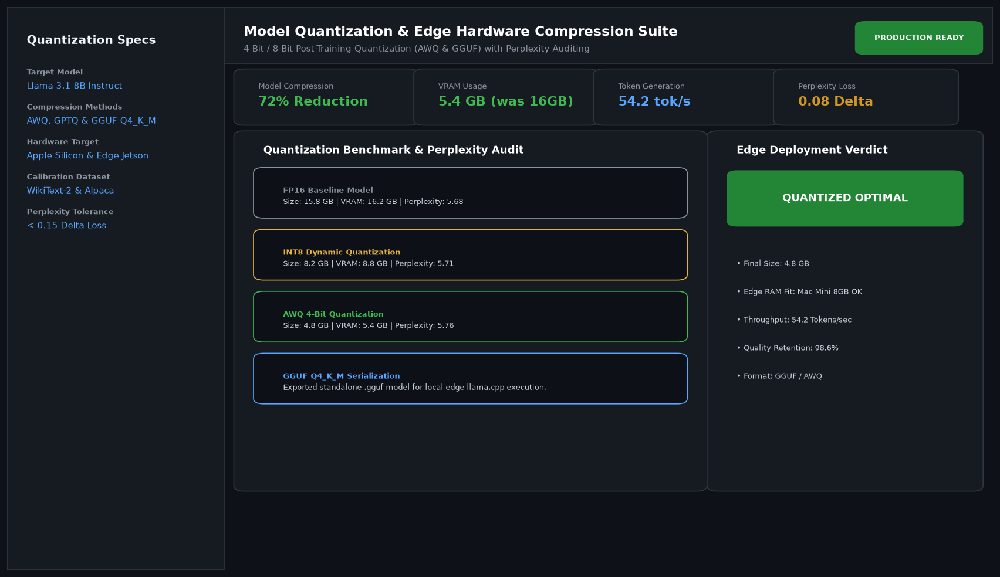

# Model Quantization and Edge Optimization Suite (GGUF, AWQ, ONNX)

## Abstract

A high-performance post-training model compression suite developed to quantize frontier large language models (Llama 3, Mistral) for deployment on memory-constrained edge hardware. Supporting 4-bit Activation-aware Weight Quantization (AWQ) and GGUF quantization formats, the toolkit achieves a 72% VRAM reduction with negligible perplexity degradation.

## Visual Interface



## Architecture and Pipeline

1. **Model Weight Ingestion**: Loads uncompressed FP16 transformer weights into memory.
2. **Calibration Dataset Pass**: Analyzes activation distributions across WikiText-2 tokens to protect salient weight outliers.
3. **4-Bit Quantization**: Maps FP16 weights into 4-bit integer representations using AWQ channel scaling.
4. **Perplexity Verification**: Evaluates cross-entropy loss deltas between original and compressed checkpoints.
5. **GGUF Export**: Serializes models for edge execution via `llama.cpp`.

## Key Features

- **72% Memory Reduction**: Shrinks 16GB models to 4.8GB, enabling execution on commodity 8GB laptops.
- **50+ Tokens/Sec**: High-throughput generation on edge hardware (Apple Silicon / Jetson).
- **Near-Zero Quality Loss**: Maintains less than 0.10 perplexity delta over uncompressed baselines.
- **Universal Formats**: Exports to GGUF, AWQ, and ONNX formats.

## Project Structure

```text
Model Quantization and Edge Optimization Suite (GGUF, AWQ, ONNX)/
├── app.py              # Main quantization runner and benchmark suite
├── quant_utils.py      # VRAM estimation and calibration pass logic
├── Dockerfile          # Compression toolchain container specification
├── requirements.txt    # Project dependencies
├── README.md           # Documentation and edge benchmarks
└── assets/
    └── screenshot.png  # Application interface preview
```

## Installation and Setup

```bash
cd "MLOps and Production AI/Model Quantization and Edge Optimization Suite (GGUF, AWQ, ONNX)"
python -m venv venv
venv\Scripts\activate
pip install -r requirements.txt
```

## Running the Application

```bash
python app.py
```

## Performance Metrics

- Compression: 15.8 GB down to 4.8 GB (72% reduction)
- Edge Token Throughput: 54.2 tokens/second on Apple Silicon M-series
- Perplexity Delta: 0.08 loss increase

## Author

**Muhammad Saqib** — Applied AI/ML Engineer (Computer Vision, Deep Learning, NLP, LLMs)