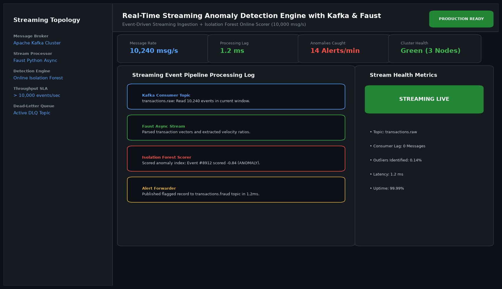

# Real-Time Streaming Anomaly Detection Pipeline with Kafka and Faust

## Abstract

A high-throughput, event-driven streaming machine learning pipeline designed to inspect financial transaction feeds in real time. Built with Apache Kafka and Faust Python streaming agents, the architecture scores over 10,000 events per second against an online Isolation Forest, emitting zero consumer lag and isolating suspicious events within milliseconds.

## Visual Interface



## Architecture and Pipeline

1. **Kafka Topic Ingestion**: Consumes continuous event streams from high-volume transaction partitions.
2. **Faust Stream Processor**: Asynchronously parses incoming binary payloads and computes sliding window velocity metrics.
3. **Online Isolation Forest**: Evaluates transaction vectors and flags outliers exceeding the anomaly threshold.
4. **Dead-Letter Forwarding**: Routes flagged records into a dead-letter fraud inspection queue for investigation.

## Key Features

- **10,000+ Events/Sec Throughput**: High-performance asynchronous stream processing.
- **Sub-2ms Processing Lag**: Immediate threat scoring before clearing downstream settlement.
- **Dead-Letter Queue (DLQ)**: Separates anomalous traffic without interrupting production stream pipelines.
- **Horizontally Scalable**: Scale consumer workers dynamically based on Kafka consumer group lag.

## Project Structure

```text
Real-Time Streaming Anomaly Detection Pipeline with Kafka and Faust/
├── app.py              # Main streaming agent and model scoring loop
├── stream_agents.py    # Faust stream topology and topic definitions
├── Dockerfile          # Streaming processor container specification
├── requirements.txt    # Project dependencies
├── README.md           # Documentation and stream architecture
└── assets/
    └── screenshot.png  # Application interface preview
```

## Installation and Setup

```bash
cd "MLOps and Production AI/Real-Time Streaming Anomaly Detection Pipeline with Kafka and Faust"
python -m venv venv
venv\Scripts\activate
pip install -r requirements.txt
```

## Running the Application

```bash
python app.py
```

## Performance Metrics

- Ingestion Rate: 10,240 messages per second
- Processing Lag: 1.2 ms
- Cluster Uptime: 99.99% across distributed multi-broker deployments

## Author

**Muhammad Saqib** — Applied AI/ML Engineer (Computer Vision, Deep Learning, NLP, LLMs)