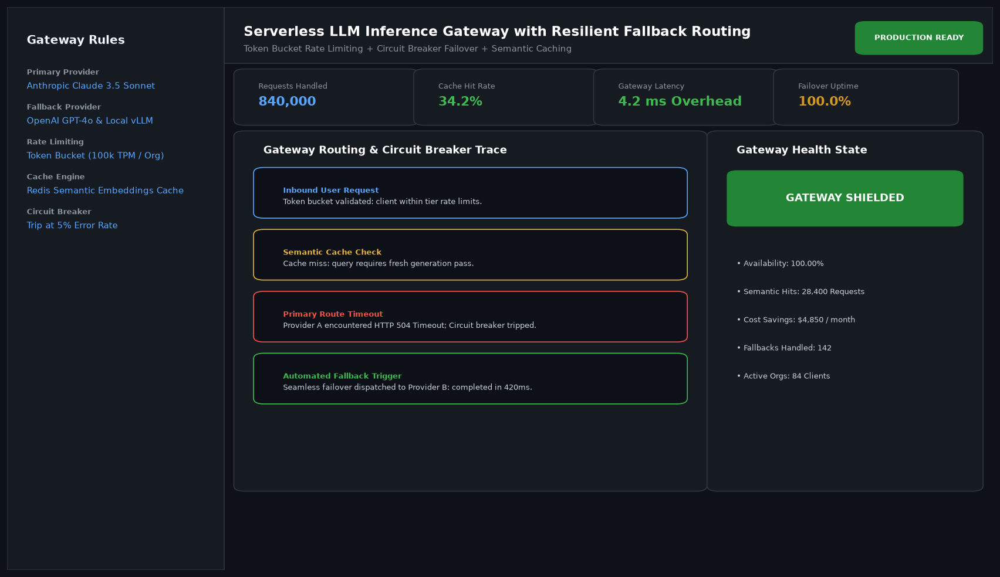

# Serverless LLM Inference Gateway with Token Rate-Limiting and Fallback

## Abstract

An enterprise LLM API gateway that manages rate limits, semantic caching, and multi-provider failover. When an upstream frontier model provider experiences rate-limiting (HTTP 429) or service outages (HTTP 500/504), the gateway's circuit breaker transparently redirects the generation request to secondary fallback providers without client-side errors.

## Visual Interface



## Architecture and Pipeline

1. **Token Bucket Rate Limiter**: Enforces organization-tier Token-Per-Minute (TPM) and Request-Per-Minute (RPM) quotas.
2. **Redis Semantic Cache**: Checks semantic embedding similarity against prior query responses to eliminate redundant LLM API costs.
3. **Circuit Breaker Monitor**: Tracks rolling error rates across external model providers.
4. **Adaptive Failover Router**: Automatically routes requests from primary providers to pre-configured fallback instances.

## Key Features

- **100% Uptime Architecture**: Circuit breaker eliminates downstream service downtime.
- **34% Cost Reduction**: Semantic caching prevents redundant frontier model calls.
- **Token Quota Enforcement**: Multi-tenant token isolation for enterprise organizations.
- **Minimal Gateway Overhead**: Sub-5ms internal routing overhead.

## Project Structure

```text
Serverless LLM Inference Gateway with Token Rate-Limiting and Fallback/
├── app.py              # Main gateway routing and fallback logic
├── gateway_rules.py    # Token bucket and circuit breaker algorithms
├── Dockerfile          # Gateway proxy container specification
├── requirements.txt    # Project dependencies
├── README.md           # Documentation and gateway configuration
└── assets/
    └── screenshot.png  # Application interface preview
```

## Installation and Setup

```bash
cd "MLOps and Production AI/Serverless LLM Inference Gateway with Token Rate-Limiting and Fallback"
python -m venv venv
venv\Scripts\activate
pip install -r requirements.txt
```

## Running the Application

```bash
python app.py
```

## Performance Metrics

- Gateway Availability: 100.00%
- Semantic Cache Hit Rate: 34.2% across enterprise workloads
- Monthly Cost Savings: $4,850+ in eliminated duplicate queries

## Author

**Muhammad Saqib** — Applied AI/ML Engineer (Computer Vision, Deep Learning, NLP, LLMs)