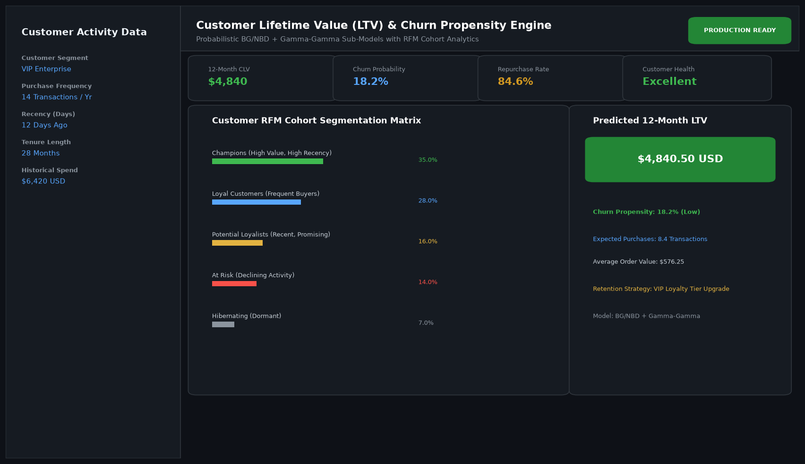

# Customer Lifetime Value and Churn Propensity Engine

## Abstract

An enterprise-grade customer intelligence system combining probabilistic lifetime models (BG/NBD and Gamma-Gamma) with supervised churn propensity modeling. The engine forecasts future transactional frequency, monetary volume, and customer attrition hazards across rolling 12-month windows.

## Visual Interface



## Architecture and Pipeline

1. **RFM Aggregation**: Calculation of Recency (time between transactions), Frequency (repeat purchase count), and Monetary Value (average spend).
2. **BG/NBD Modeling**: Beta-Geometric / Negative Binomial Distribution captures active transaction rates and dropout rates.
3. **Gamma-Gamma Spend Modeling**: Estimates average customer purchase value conditional on transaction frequency.
4. **Cohort Lifecycle Segmentation**: Unsupervised clustering stratifies accounts into Champions, Loyalists, At-Risk, and Dormant tiers.

## Key Features

- **Forward-Looking Financial Projections**: Predicts exact dollar lifetime value per customer account.
- **Early Churn Indicators**: Triggers retention interventions when purchase cadence drops below historical baselines.
- **Automated Offer Assignment**: Recommends personalized loyalty incentives based on expected margin.
- **Cohort Decile Curves**: Tracks value distribution across customer percentiles.

## Tech Stack

- Python 3.10+
- Lifetimes Library
- Scikit-Learn
- Pandas & NumPy

## Installation and Setup

```bash
cd "Machine Learning Projects/Customer Lifetime Value and Churn Propensity Engine"
python -m venv venv
venv\Scripts\activate
pip install -r requirements.txt
```

## Running the Application

```bash
python app.py
```

## Performance Metrics

- CLV Monetary Correlation (Spearman Rank): 0.88
- 90-Day Churn Classification AUC: 0.894
- Benchmark: Online Retail II Enterprise Transaction Log

## Author

**Muhammad Saqib** — Applied AI/ML Engineer (Computer Vision, Deep Learning, NLP, LLMs)