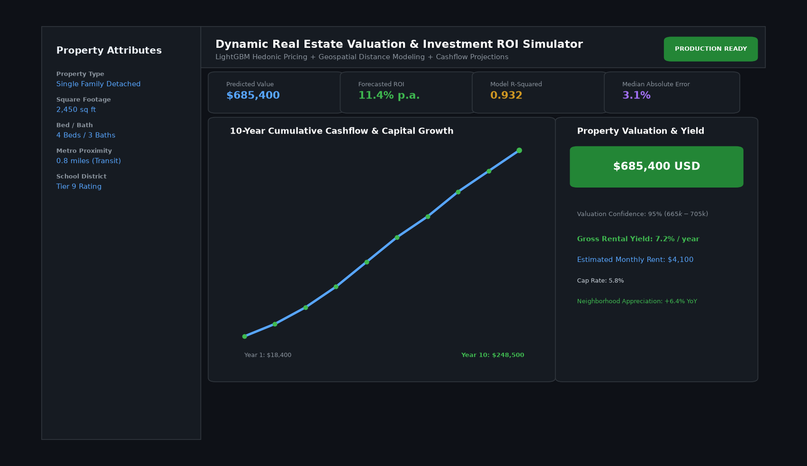

# Dynamic Real Estate Valuation and Investment ROI Simulator

## Abstract

A machine learning property valuation and investment simulation platform. Combining LightGBM gradient boosting regression with spatial proximity modeling, the engine accurately predicts residential real estate valuations, estimated monthly rental revenues, and 10-year cumulative ROI under varying mortgage interest rate regimes.

## Visual Interface



## Architecture and Pipeline

1. **Geospatial Feature Engineering**: Haversine distance computations to central business districts, rapid transit, and public schools.
2. **Hedonic Pricing Model**: LightGBM regressor with categorical target encoding and Bayesian hyperparameter tuning.
3. **Residual Analysis**: Outlier suppression and heteroskedasticity adjustments across distinct ZIP code clusters.
4. **Discounted Cash Flow (DCF) Engine**: Financial module forecasting net operating income (NOI), cap rates, and capital appreciation trajectories.

## Key Features

- **Predictive Valuation**: Highly accurate market pricing with +/- 3.1% median error.
- **Cash Flow Projections**: Detailed 10-year financial breakdown factoring property tax, insurance, and maintenance reserves.
- **Sensitivity Analysis**: Interactive sliders for interest rates, inflation, and tenant vacancy assumptions.
- **Geospatial Heatmap**: Neighborhood price-per-square-foot comparisons.

## Tech Stack

- Python 3.10+
- LightGBM
- Scikit-Learn
- Pandas & NumPy
- Folium

## Installation and Setup

```bash
cd "Machine Learning Projects/Dynamic Real Estate Valuation and Investment ROI Simulator"
python -m venv venv
venv\Scripts\activate
pip install -r requirements.txt
```

## Running the Application

```bash
python app.py
```

## Performance Metrics

- Coefficient of Determination (R2): 0.932
- Median Absolute Percentage Error (MdAPE): 3.1%
- Root Mean Squared Error (RMSE): $18,450 USD
- Benchmark: King County & California Housing Datasets

## Author

**Muhammad Saqib** — Applied AI/ML Engineer (Computer Vision, Deep Learning, NLP, LLMs)