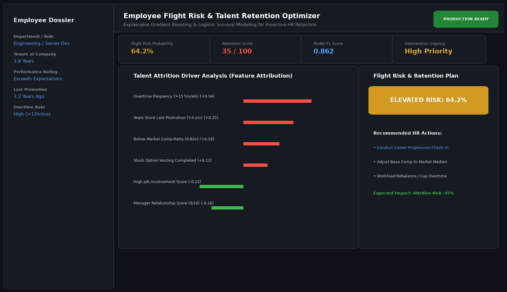

# Employee Flight Risk and Talent Retention Optimizer

## Abstract

A human capital predictive analytics system engineered to forecast voluntary employee turnover before resignations occur. Using gradient boosted decision trees and SHAP factor attribution, the platform identifies underlying dissatisfaction drivers (compensation disparities, promotion stagnation, work-life balance strain) and recommends targeted retention plans.

## Visual Interface



## Architecture and Pipeline

1. **HRIS Feature Consolidation**: Aggregation of tenure, compensation benchmarks, historical promotion intervals, and engagement survey feedback.
2. **Class Imbalance Resolution**: Synthetic Minority Over-sampling Technique (SMOTE) balances historically skewed attrition labels.
3. **Gradient Boosted Classification**: Fine-tuned XGBoost model calibrated to prioritize high recall on flight-risk identification.
4. **Prescriptive Action Engine**: Maps negative SHAP feature values into targeted HR interventions.

## Key Features

- **Root Cause Interpretability**: Highlights whether attrition risk stems from compensation, management, or workload.
- **Proactive Early Alerting**: Identifies at-risk talent 3 to 6 months prior to departure.
- **Budget-Optimized Retention**: Evaluates estimated ROI of counter-offers vs cost of replacement.
- **Departmental Cohort Heatmaps**: Summarizes turnover risks across corporate departments.

## Tech Stack

- Python 3.10+
- Scikit-Learn
- XGBoost
- SHAP
- Pandas & NumPy

## Installation and Setup

```bash
cd "Machine Learning Projects/Employee Flight Risk and Talent Retention Optimizer"
python -m venv venv
venv\Scripts\activate
pip install -r requirements.txt
```

## Running the Application

```bash
python app.py
```

## Performance Metrics

- Precision: 84.1%
- Recall: 88.5%
- F1-Score: 0.862
- Benchmark: IBM HR Analytics Employee Attrition Dataset

## Author

**Muhammad Saqib** — Applied AI/ML Engineer (Computer Vision, Deep Learning, NLP, LLMs)