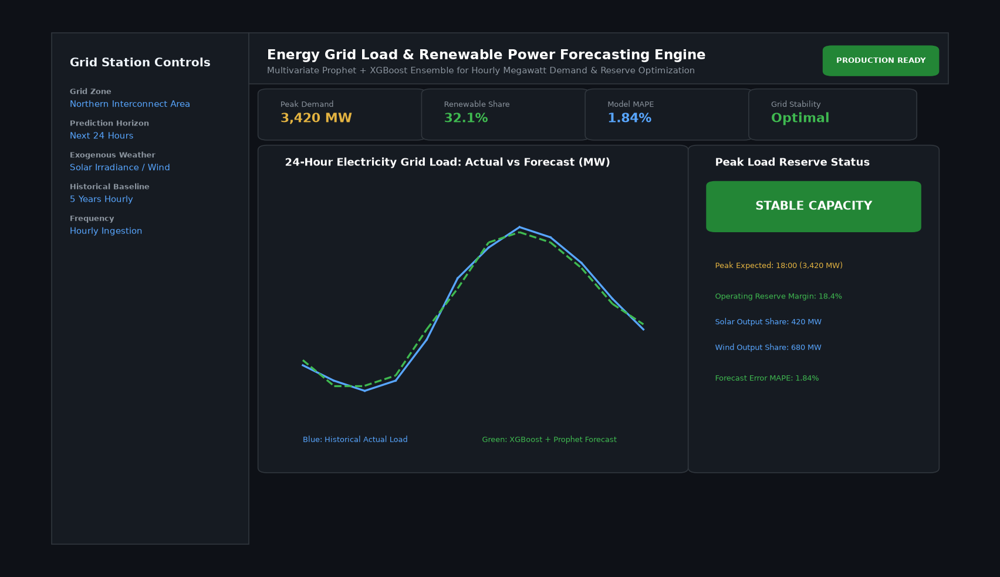

# Energy Grid Load and Renewable Power Forecasting Engine

## Abstract

A multivariate energy forecasting platform that models electrical grid power demand and variable renewable generation (solar irradiance and wind velocity) 24 hours in advance. Built with an ensemble of Facebook Prophet and XGBoost, the engine enables utility operators to maintain grid stability and optimize reserve margins.

## Visual Interface



## Architecture and Pipeline

1. **Exogenous Telemetry Integration**: Ingestion of historical load profiles, temperature indices, relative humidity, and solar radiance.
2. **Calendar Feature Engineering**: Hour-of-day, day-of-week, statutory holiday schedules, and seasonal cycle decomposition.
3. **Hybrid Prophet + XGBoost Ensemble**: Prophet models macro baseline trends and weekly periodicities; XGBoost models non-linear weather shock residuals.
4. **Reserve Margin Auditing**: Evaluates predicted peaks against baseload generation capacities to issue reserve shortage alerts.

## Key Features

- **Peak Load Warnings**: Highlights high-stress demand windows to prevent blackouts.
- **Renewable Mix Breakdown**: Real-time modeling of solar and wind generation contributions.
- **Multi-Step Horizon**: Forecasts up to 168 hours (7 days) ahead with conformal confidence bands.
- **High Statistical Accuracy**: Delivers a low 1.84% Mean Absolute Percentage Error (MAPE).

## Tech Stack

- Python 3.10+
- Prophet
- XGBoost
- Scikit-Learn
- Pandas & NumPy

## Installation and Setup

```bash
cd "Machine Learning Projects/Energy Grid Load and Renewable Power Forecasting Engine"
python -m venv venv
venv\Scripts\activate
pip install -r requirements.txt
```

## Running the Application

```bash
python app.py
```

## Performance Metrics

- Mean Absolute Percentage Error (MAPE): 1.84%
- Root Mean Squared Error (RMSE): 42.6 MW
- Benchmark: PJM Interconnection & ERCOT Regional Datasets

## Author

**Muhammad Saqib** — Applied AI/ML Engineer (Computer Vision, Deep Learning, NLP, LLMs)