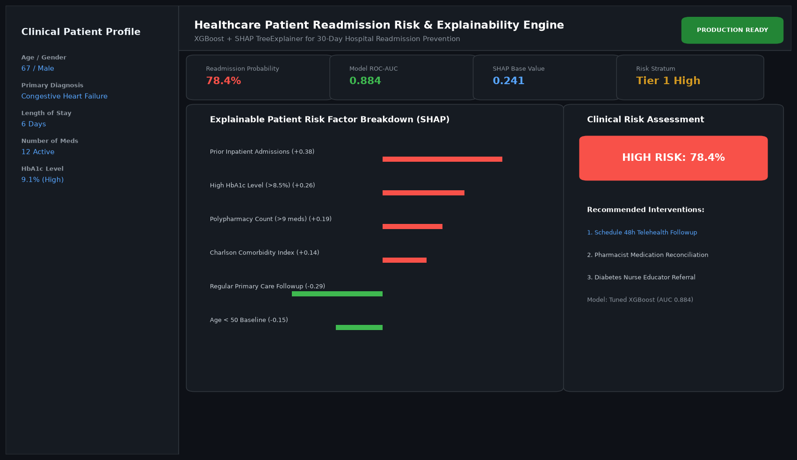

# Explainable Healthcare Patient Readmission Risk Predictor

## Abstract

A machine learning framework developed to identify and mitigate 30-day unplanned hospital readmissions among high-risk patients. Utilizing tuned XGBoost gradient boosting paired with SHAP (SHapley Additive exPlanations) TreeExplainer, the system provides clinical staff with transparent, patient-specific explanations and risk factor attributions.

## Visual Interface



## Architecture and Pipeline

1. **EHR Data Preprocessing**: Clinical data harmonization, categorical encoding (ICD-10 clusters), and median imputation of missing lab tests.
2. **Feature Engineering**: Ratio of emergency vs inpatient encounters, Charlson Comorbidity Index calculation, and polypharmacy metrics.
3. **Imbalanced Classification**: XGBoost gradient boosted trees optimized via cost-sensitive learning and scale_pos_weight tuning.
4. **Explainability Engine (SHAP)**: Calculation of exact Shapley values decomposes individual readmission scores into positive and negative risk contributors.

## Key Features

- **SHAP Waterfall & Force Visualizations**: Unmasks why a specific patient is flagged as high risk.
- **Actionable Interventions**: Generates personalized clinical guidance (e.g. rapid follow-up scheduling).
- **High Calibration**: Evaluated using Brier score and Platt scaling for trustworthy probabilities.
- **HIPAA-Compliant Schema**: Operates locally without external cloud dependencies.

## Tech Stack

- Python 3.10+
- XGBoost
- SHAP
- Scikit-Learn
- Pandas & NumPy

## Installation and Setup

```bash
cd "Machine Learning Projects/Explainable Healthcare Patient Readmission Risk Predictor"
python -m venv venv
venv\Scripts\activate
pip install -r requirements.txt
```

## Running the Application

```bash
python app.py
```

## Performance Metrics

- ROC-AUC: 0.884
- PR-AUC: 0.812
- Sensitivity at 70% Specificity: 84.6%
- Benchmark: UCI Diabetes 130-US Hospitals Dataset

## Author

**Muhammad Saqib** — Applied AI/ML Engineer (Computer Vision, Deep Learning, NLP, LLMs)