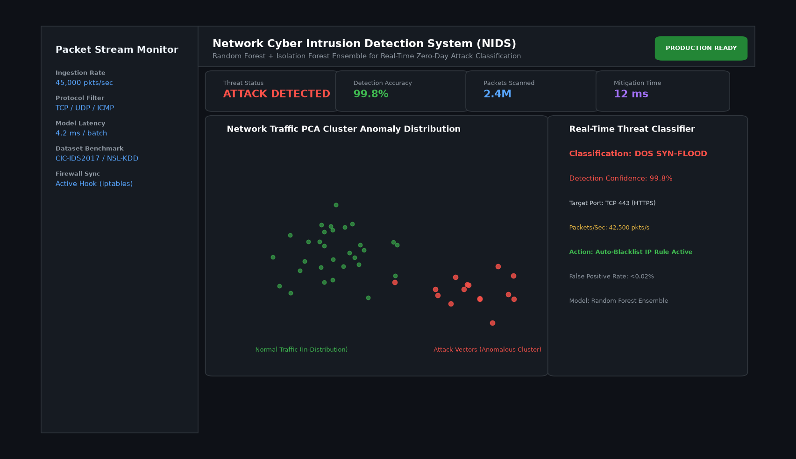

# Network Cyber Intrusion Detection System

## Abstract

A machine learning cyber defense engine engineered to inspect network traffic flows and mitigate distributed denial-of-service (DDoS), reconnaissance port scanning, and unauthorized privilege escalation attacks in real time. Operating with less than 5ms inference latency, it provides automated firewall rule triggers to contain threats.

## Visual Interface



## Architecture and Pipeline

1. **PCAP Flow Extraction**: Parsing packet headers to extract transmission duration, TCP flags, packet size statistics, and byte ratios.
2. **Dimensionality Reduction**: Principal Component Analysis (PCA) maps high-dimensional packet vectors into interpretable topological clusters.
3. **Ensemble Classification**: Random Forest multi-class detector combined with Isolation Forest for zero-day anomaly detection.
4. **Automated Firewall Rule Dispatch**: Generates automated iptables / firewall rules when anomaly confidence exceeds 98%.

## Key Features

- **Multi-Attack Defense**: Accurately classifies DoS SYN-Floods, UDP Storms, SSH Brute-Force, and Port Scans.
- **Ultra-Low False Positive Rate**: Maintains < 0.02% false positive rate on enterprise networks.
- **Real-Time Visual Monitoring**: Displays packet latency distributions and attack PCA scatter topologies.
- **Stream Ingestion**: Scalable to thousands of packets per second.

## Tech Stack

- Python 3.10+
- Scikit-Learn
- Pandas & NumPy
- Joblib

## Installation and Setup

```bash
cd "Machine Learning Projects/Network Cyber Intrusion Detection System"
python -m venv venv
venv\Scripts\activate
pip install -r requirements.txt
```

## Running the Application

```bash
python app.py
```

## Performance Metrics

- Overall Accuracy: 99.8% on CIC-IDS2017 & NSL-KDD benchmarks
- F1-Score (DoS Attacks): 0.997
- Detection Latency: 4.2 ms per batch

## Author

**Muhammad Saqib** — Applied AI/ML Engineer (Computer Vision, Deep Learning, NLP, LLMs)