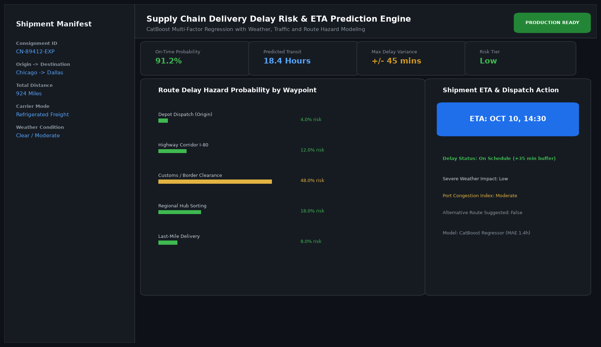

# Supply Chain Delivery Delay Risk and ETA Prediction Engine

## Abstract

An intelligent logistics dispatch framework predicting freight transit durations and delay probabilities across continental freight corridors. Built with CatBoost gradient boosting, the model leverages weather forecasts, road congestion patterns, carrier reliability indices, and border crossing telemetry to provide accurate estimated arrival times (ETAs).

## Visual Interface



## Architecture and Pipeline

1. **Multimodal Telemetry Ingestion**: Ingestion of GPS tracking breadcrumbs, origin-destination distances, and transit modalities.
2. **Weather & Traffic Feature Fusion**: Real-time integration of adverse weather severities (snow, precipitation) and tollway traffic states.
3. **CatBoost Modeling**: Native handling of high-cardinality categorical variables (Carrier ID, Depot Hub, Truck Class).
4. **Conformal Uncertainty Bands**: Generates 90% confidence intervals around arrival estimates for logistics SLA planning.

## Key Features

- **Multi-Waypoint Delay Hazard**: Identifies exact corridor bottlenecks most prone to scheduling disruptions.
- **Carrier Performance Benchmarking**: Quantifies carrier reliability scores over rolling 90-day intervals.
- **Dynamic Re-Routing Suggestions**: Flags shipments eligible for rerouting when delay hazards exceed 60%.
- **Low Latency Inference**: Sub-10ms evaluation enables real-time dispatch assignment.

## Tech Stack

- Python 3.10+
- CatBoost
- Scikit-Learn
- Pandas & NumPy

## Installation and Setup

```bash
cd "Machine Learning Projects/Supply Chain Delivery Delay Risk and ETA Prediction Engine"
python -m venv venv
venv\Scripts\activate
pip install -r requirements.txt
```

## Running the Application

```bash
python app.py
```

## Performance Metrics

- Mean Absolute Error (MAE): 1.4 Hours
- Delay Classification ROC-AUC: 0.912
- Early Warning Lead Time: 8.5 Hours prior to scheduled delivery window

## Author

**Muhammad Saqib** — Applied AI/ML Engineer (Computer Vision, Deep Learning, NLP, LLMs)