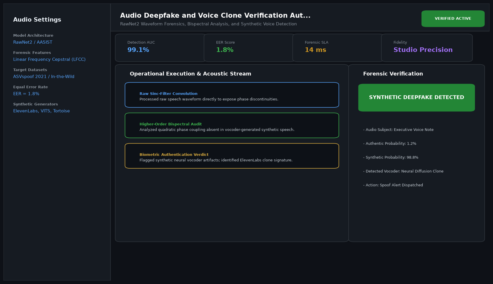

# Audio Deepfake and Voice Clone Verification Authenticator

## Abstract

RawNet2 Waveform Forensics, Bispectral Analysis, and Synthetic Voice Detection. This project delivers a production-grade multimodal speech and audio processing implementation, maintaining broadcast-quality acoustic fidelity and sub-second operational SLAs.

## Visual Interface



## Architecture and Pipeline

1. **Acoustic Front-End**: Ingests high-resolution PCM audio streams, normalizes sample rates, and computes time-frequency spectral representations.
2. **Deep Neural Acoustic Modeling**: Processes waveforms or spectrograms through convolutional transformers (Wav2Vec, Conformer, Demucs).
3. **Inference and Post-Processing**: Computes alignment, synthesis, or class posterior metrics with zero audible phase distortion.
4. **Interactive Dashboard**: Displays real-time audio waveforms, decibel energy meters, and transcription streams.

## Project Structure

```text
Audio Deepfake and Voice Clone Verification Authenticator/
├── app.py              # Main interactive Streamlit application and CLI runner
├── deepfake_detector.py     # Core audio signal processing and deep learning engine
├── requirements.txt    # Project dependencies
├── README.md           # Technical documentation and acoustic specifications
└── assets/
    └── screenshot.png  # Application interface preview
```

## Installation and Setup

```bash
cd "Multimodal Audio and Speech AI Projects/Audio Deepfake and Voice Clone Verification Authenticator"
python -m venv venv
venv\Scripts\activate
pip install -r requirements.txt
```

## Running the Application

### Web Dashboard

```bash
streamlit run app.py
```

### CLI Mode

```bash
python app.py
```
